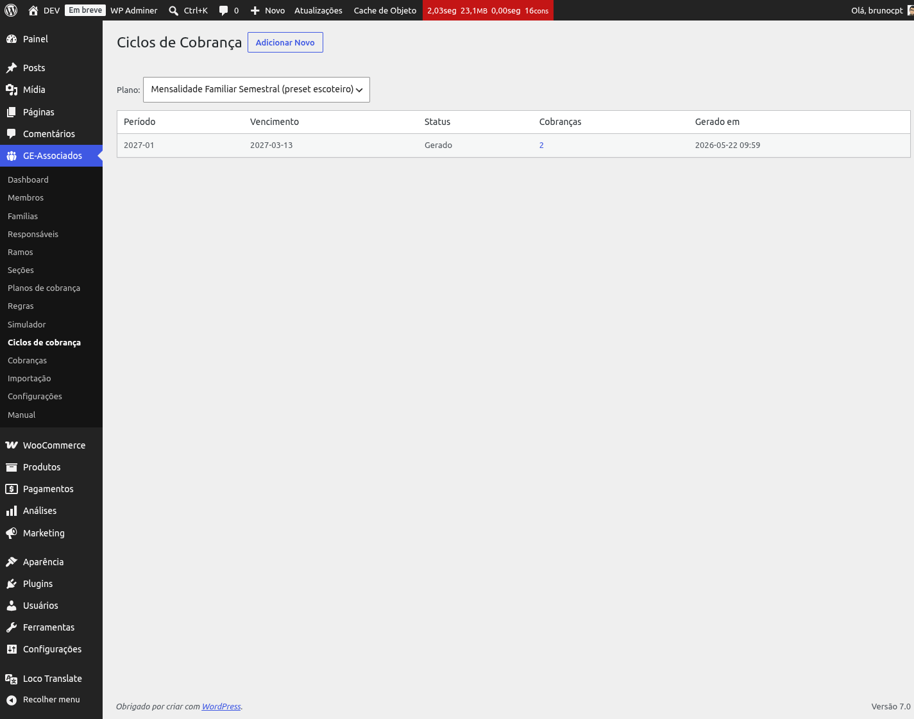
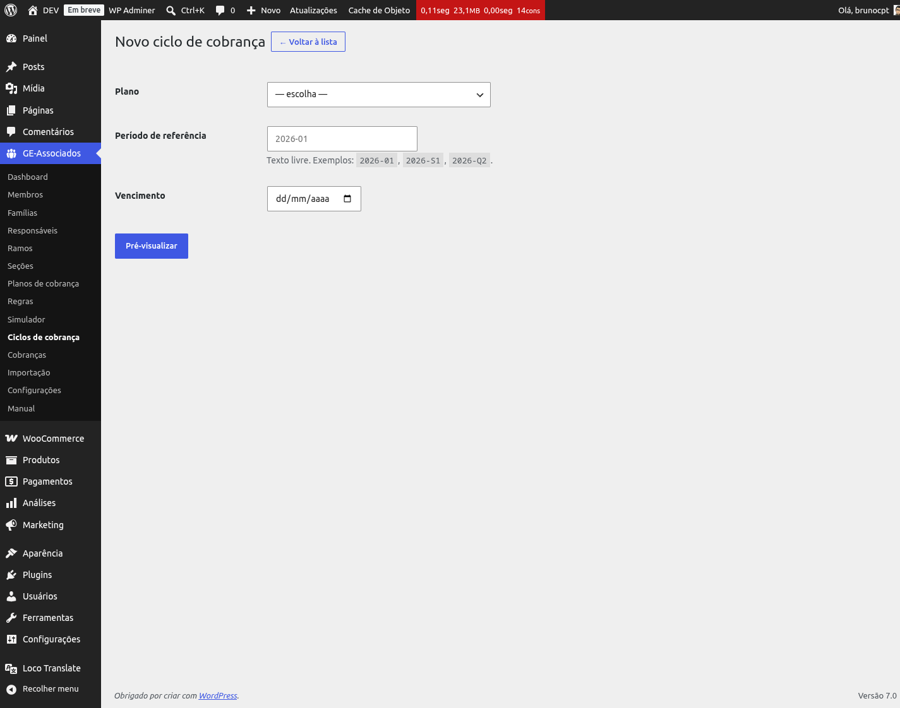
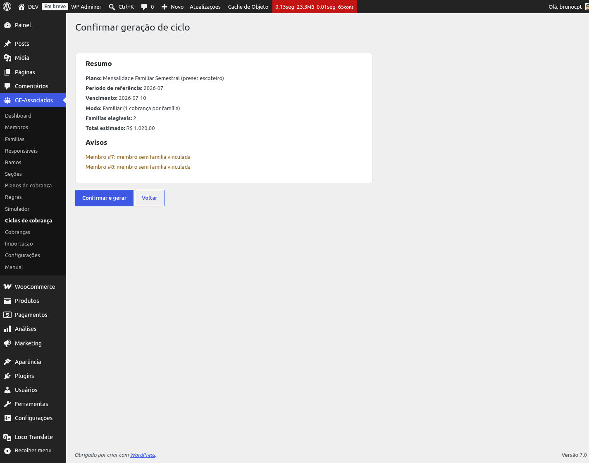

# Ciclos de cobrança

Um **ciclo de cobrança** agrupa todas as cobranças geradas em uma única rodada — tipicamente uma
vez por período (mensal, semestral, anual). Você escolhe um plano + um identificador de período
+ uma data de vencimento; o sistema cria uma cobrança por membro elegível (em planos individuais)
ou uma por família (em planos familiares), congelando o **snapshot imutável** das regras e do
plano vigentes naquele momento.

*Listagem de ciclos do plano selecionado. O número na coluna Cobranças é clicável e leva ao
painel de Cobranças filtrado por esse ciclo.*

## Como gerar um ciclo (em 2 passos)

Em **GE-Associados → Ciclos de cobrança**, clique em **Adicionar Novo**. O formulário pede três
campos:

- **Plano** — qual *BillingPlan* vai ser cobrado. O modo (individual ou familiar), o valor base,
  a faixa etária e o limite de cobranças vêm dele.
- **Período de referência** — texto livre que identifica o período. Convenções comuns:
  `2026-01` (janeiro/2026), `2026-S1` (1º semestre), `2026-Q2` (2º trimestre), `2026-A` (anual).
  O sistema só exige que o par *(plano, período)* seja único — não interpreta o conteúdo.
- **Vencimento** — data que vai aparecer em todas as cobranças do ciclo. Pode ser ajustada depois
  cobrança a cobrança no painel de cobranças.

*Formulário enxuto: plano + período + vencimento. O botão Pré-visualizar leva à tela de
confirmação.*

Ao clicar em **Pré-visualizar**, o sistema roda o gerador em modo *dry-run*: simula tudo sem
persistir nada no banco. Você vê um resumo com modo (Familiar ou Individual), quantos elegíveis
vão ser cobrados, total estimado em R$ da rodada e a lista de avisos por membro excluído.
Confirmando, o ciclo passa de *DRAFT* para *GENERATED* e as cobranças são gravadas.

*Resumo da geração antes de confirmar. Você pode voltar e ajustar, ou confirmar para criar as
cobranças de fato.*

{: .tip }
> **Por que 2 passos?** A confirmação grava cobranças no banco e dispara eventos de auditoria. A
> pré-visualização permite ver quantas cobranças vão ser criadas e o valor total *antes* de
> salvar — evitando rodadas erradas por engano (plano incorreto, data trocada, período repetido,
> etc.). Confira sempre o total estimado contra o que você espera antes de confirmar.

## Avisos do preview: membros excluídos

Antes de confirmar, o preview lista todos os membros que **entraram no escopo do plano mas não
vão ser cobrados**, com o motivo de cada exclusão. Você decide se isso é esperado (e confirma)
ou se algo precisa ser corrigido (e cancela para ajustar cadastro/plano antes). Os motivos
possíveis são:

- **Sem família vinculada** — em plano familiar, o membro não tem família atribuída.
- **Família não encontrada** — o membro referencia uma família que não existe no sistema.
- **Família de outra organização** — escopo cruzado entre organizações (não é o caso típico, mas
  o gerador protege).
- **Idade abaixo da mínima do plano** — calculada na *due_date* do ciclo, comparada com
  `min_age` do plano.
- **Idade acima da máxima do plano** — idem, comparada com `max_age`.
- **Limite de cobranças atingido** — o membro já bateu o `max_charges_per_member` definido no
  plano (contagem life-time).
- **Fim de cobrança ultrapassado** — a `billing_end_date` do membro é anterior à *due_date* do
  ciclo.

*Preview destacando um membro excluído por data de fim de cobrança ultrapassada. Use a lista
para decidir se confirma a geração ou cancela para ajustar cadastros.*

## O que é gerado na confirmação

Cada cobrança criada no ciclo grava, no momento da confirmação:

- **base_amount** — em plano individual é o `base_amount` do plano; em plano familiar é
  `base_amount × número de membros` elegíveis da família.
- **rule_snapshot_json** — fotografia das regras vigentes do plano no T0 (geração). É essa cópia
  imutável que serve de base ao cálculo final e à auditoria.
- **breakdown_json** — gravado como *string vazia* no T0. O detalhamento (descontos, acréscimos,
  créditos aplicados) só é calculado quando a cobrança é efetivamente paga — no checkout do
  WooCommerce ou no `payment_complete`. Isso garante que o valor final reflita o estado real do
  membro/família na hora do pagamento, sem desalinhar com o preview.
- **status** — começa como *PENDING*.

{: .note }
> **Mudança da v0.28.0:** antes, o motor de regras rodava na geração e o resultado ficava
> congelado em `breakdown_json`. A partir da v0.28.0, o motor roda *só no momento do pagamento* —
> a geração apenas calcula o valor base e congela as regras. Resultado: cobranças aceitam
> ajustes de cadastro (novo membro na família, mudança de status) sem precisar regerar o ciclo
> inteiro.

## Fim de cobrança: três limites diferentes

Existem três mecanismos para encerrar a cobrança de um membro — todos avaliados na *due_date* do
ciclo:

- **billing_end_date no membro** — campo individual no cadastro do membro. Útil quando alguém
  saiu da associação numa data específica e não deve mais aparecer em ciclos a partir dessa
  data.
- **min_age / max_age no plano** — faixa etária aceita pelo plano. Membros fora da faixa na data
  de vencimento entram na lista de excluídos do preview.
- **max_charges_per_member no plano** — número máximo de cobranças que um mesmo membro pode
  receber daquele plano ao longo da vida. Quando atinge, fica fora de novos ciclos
  automaticamente.

Os três são independentes e podem ser combinados — basta um deles ser violado para o membro
ficar de fora.

## Status do ciclo

- **DRAFT** — estado inicial transitório usado internamente pelo gerador. Você normalmente não
  vê ciclos nesse status na listagem, porque a confirmação grava o ciclo já como *GENERATED* na
  mesma operação. O preview, antes da confirmação, não cria nenhum registro — é cálculo em
  memória.
- **GENERATED** — confirmado: as cobranças foram gravadas. É o status normal de operação. O
  painel de cobranças permite ajustar cada cobrança individualmente.
- **CLOSED** — ciclo encerrado, não aceita mais alterações. Hoje é uma marca administrativa (não
  há botão dedicado na interface) — útil para fechar contabilmente o período.

## Idempotência: não dá para gerar 2x o mesmo período

O par **(plano, período de referência)** é chave única. Se você tentar gerar de novo o mesmo
`2026-01` do Plano Anual, o sistema mostra erro pedindo para cancelar o ciclo existente primeiro.
Isso protege contra duplicação acidental de cobranças.

{: .warning }
> Se você errou o vencimento ou o plano de um ciclo já confirmado, **não dá para editar o
> ciclo**. Na própria listagem de Ciclos, cada ciclo com cobranças pendentes ou aguardando
> pedido ganha um link **"Cancelar pendentes (N)"** na coluna Ações: um clique cancela todas de
> uma vez (preserva as já pagas e as já canceladas), registrando o motivo "regras alteradas após
> geração do ciclo" no histórico de cada uma. Depois de cancelar, gere um ciclo novo com o
> período corrigido — as cobranças pagas do ciclo antigo continuam intactas.

## Drill para o detalhe das cobranças

Na listagem de ciclos, a coluna **Cobranças** mostra a contagem de cobranças geradas e funciona
como link: clicar leva direto ao [Painel de cobranças](charges) já filtrado por aquele ciclo. É
o atalho natural para revisar uma rodada — ver pagas, pendentes, valores ajustados.
