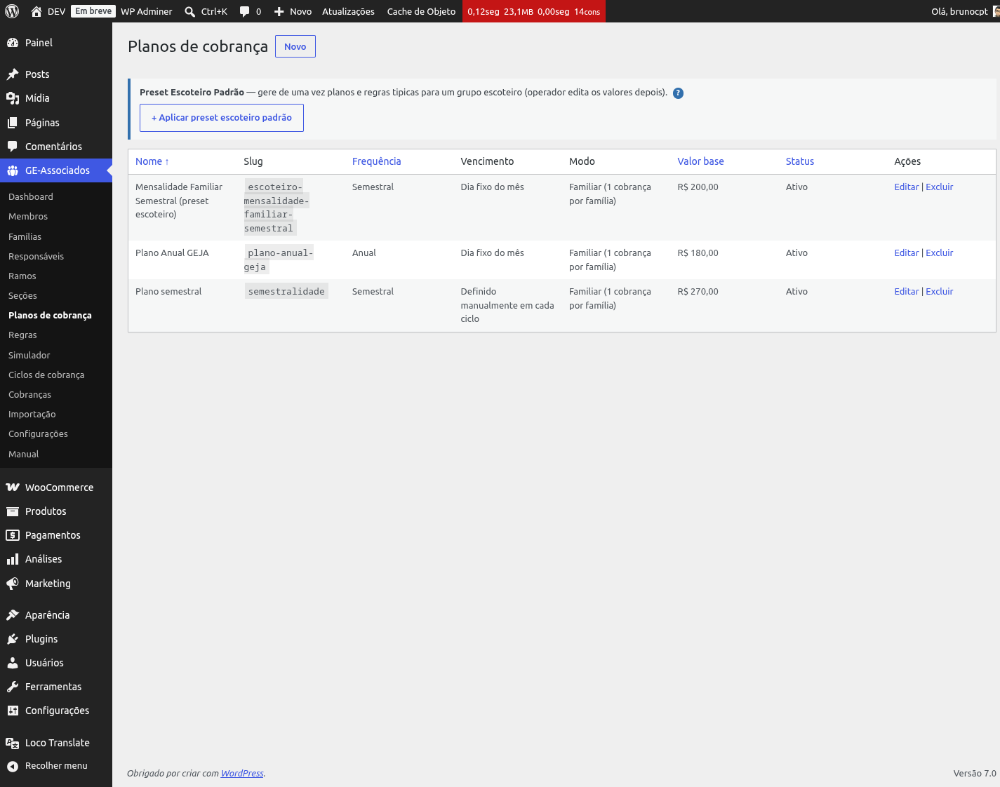
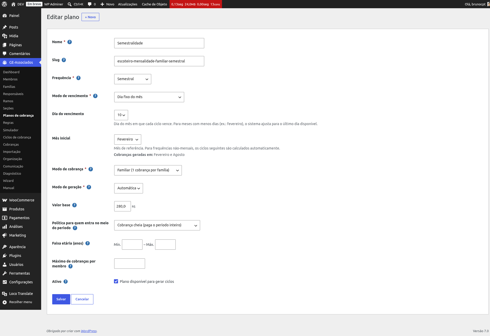

# Planos de cobrança

Um **plano de cobrança** (Billing Plan) é o molde que define *como*, *quando* e *quanto*
cobrar. Cada plano é cobrado periodicamente em *ciclos* — cada ciclo gera as cobranças do
período daquele plano. Você pode ter vários planos coexistindo: por exemplo, "Mensalidade
Familiar Semestral", "Anuidade da Federação" e "Taxa de Acampamento" são três planos
independentes.

*Listagem em GE Associados → Planos de cobrança. Cada linha mostra nome, slug, frequência,
vencimento, modo, valor base e status.*

## Onde acessar

O cadastro de planos fica em **GE Associados → Planos de cobrança**. Use **Novo** para criar do
zero, ou o botão **Aplicar preset** para criar um plano (e regras) já pronto com base em um
modelo conhecido (ver "Presets disponíveis" abaixo).

## Campos do plano

- **Nome** (obrigatório) — texto livre exibido em todas as telas e na cobrança do associado.
  Ex.: *"Mensalidade GEJA 2026"*.
- **Slug** — identificador interno, útil para presets e integrações. Deixe vazio para gerar
  automaticamente a partir do nome.
- **Frequência** (obrigatório) — periodicidade do plano: *Mensal*, *Trimestral*, *Semestral*,
  *Anual* ou *Avulsa (uma vez)*. A frequência define quantos ciclos por ano são esperados
  (1 mensal = 12 ciclos/ano; 1 semestral = 2 ciclos/ano).
- **Modo de vencimento** (obrigatório) — como o vencimento de cada ciclo é calculado: *Dia fixo
  do mês* (escolhe o dia 1–31 e, em frequências não-mensais, o mês inicial), *Relativo a um
  evento* (vencimento = data do evento + N dias, com eventos disponíveis "Início do período de
  cobrança" e "Data de registro do membro") ou *Definido manualmente em cada ciclo*.
- **Modo de cobrança** (obrigatório) — *Individual* (1 cobrança por membro elegível), *Familiar*
  (1 cobrança por família, com cada membro elegível ocupando uma linha do total) ou *Híbrido*
  (combina os dois conforme o vínculo de família e responsável financeiro de cada membro). Veja
  a comparação e a seção "Modo híbrido" abaixo.
- **Modo de geração** (obrigatório) — *Manual* (você cria cada ciclo na tela de Ciclos) ou
  *Automática* (no roadmap: cron geraria nas datas configuradas; hoje só Manual é executado de
  fato).
- **Valor base** — em reais, antes da aplicação das regras (descontos, acréscimos, multas). Pode
  ficar em 0,00 quando o plano só serve como gatilho para regras.
- **Política para quem entra no meio do período** (proration) — define o que cobrar de um membro
  que ingressa após o início do ciclo atual. Opções: *Cobrança cheia (paga o período inteiro)*,
  *Proporcional por dias do período* ou *Pula o período atual (começa no próximo ciclo)*.
  Default: cobrança cheia.
- **Faixa etária (anos)** — mínima e/ou máxima. Em branco, não restringe. A idade é calculada na
  *data de vencimento* do ciclo. Membros fora da faixa são listados como excluídos no preview do
  ciclo (motivo: "idade abaixo da mínima" ou "idade acima da máxima").
- **Máximo de cobranças por membro** — limite de quantas cobranças um mesmo membro pode receber
  deste plano ao longo da vida (cancelamentos não contam). Em branco, sem limite. Útil para
  planos finitos do tipo "12 parcelas".
- **Categoria de produto (WooCommerce)** — opcional. Ver seção dedicada abaixo.
- **Ativo** — desativar oculta o plano da geração de ciclos sem apagar ciclos ou cobranças
  existentes.

{: .note }
> **Escopo do plano:** o domínio prevê três escopos (*GLOBAL* — toda a organização, *BRANCH* — só
> um ramo, *SECTION* — só uma seção) e o motor de elegibilidade já respeita isso na geração de
> ciclos. Hoje, porém, o formulário de cadastro não expõe esse campo — planos criados pela tela
> viram *GLOBAL* automaticamente. Para criar planos com escopo restrito, use um **preset** (que
> pode trazer o escopo já configurado) ou ajuste via SQL/API.

*Formulario completo do plano: nome, slug, frequencia, vencimento, modo, valor base, proracao,
faixa etaria e limite de cobrancas.*

## Categoria de produto WooCommerce

*Novidade da v1.1.4.* Cada plano pode ser vinculado a uma **categoria de produto do
WooCommerce** — escolhendo uma categoria já existente na loja no dropdown, ou digitando um nome
novo no campo "ou criar nova" (o plugin cria a categoria na hora, se ela ainda não existir).

Por que isso importa: sem categoria, todas as cobranças de todos os planos caem no mesmo produto
técnico interno (`gea-mensalidade`) e aparecem misturadas nos relatórios do WooCommerce.
Definindo uma categoria por plano, os relatórios da loja (receita por categoria, produtos mais
vendidos etc.) passam a separar, por exemplo, "Mensalidade Familiar" de "Taxa de Acampamento" —
sem você precisar tocar em nada no financeiro do WooCommerce em si.

{: .warning }
> **Trocar a categoria reclassifica o histórico inteiro do plano — inclusive cobranças já
> pagas.** O plugin não cria um produto novo a cada troca: ele reclassifica o mesmo produto
> técnico do plano, e todos os pedidos WooCommerce que já apontam para ele (passados e futuros)
> passam a contar na categoria nova. Se você só quer classificar as cobranças **daqui para
> frente**, crie um plano novo em vez de editar a categoria do plano existente.
>
> Deixar o campo em branco mantém o comportamento anterior à v1.1.4: sem classificação, cobrança
> cai no produto técnico compartilhado.

{: .tip }
> Dê nomes de categoria que façam sentido nos relatórios da loja, não nomes técnicos do plugin.
> "Mensalidade Semestral" funciona melhor num relatório do WooCommerce do que o slug interno do
> plano.

Veja também: [Integração WooCommerce](woocommerce).

## Individual vs. Familiar

Essa é a decisão estrutural mais importante do plano. Os dois modos geram *uma cobrança por
membro* ou *uma cobrança por família*:

- **Individual**: para cada membro elegível no escopo, o ciclo cria uma cobrança separada com o
  `valor base` do plano. Recomendado para taxas que pertencem ao indivíduo — anuidade federada,
  carteirinha, taxa de adesão.
- **Familiar**: para cada família elegível, o ciclo cria uma única cobrança com valor
  `base × número de membros elegíveis da família`. Cada membro coberto vira uma *linha* da
  cobrança (visível na aba Membros do detalhe e na exportação XLSX). Recomendado para
  mensalidades em que faz sentido cobrar a família inteira de uma vez, com responsável
  financeiro único recebendo a fatura.

**Exemplo concreto.** Plano *Mensalidade Familiar Semestral* com base R$ 100,00, família de 3
membros elegíveis. Em modo *Individual*: 3 cobranças de R$ 100,00 (uma por membro). Em modo
*Familiar*: 1 cobrança de R$ 300,00 destinada ao responsável financeiro da família, com 3 linhas
internas de R$ 100,00.

{: .note }
> Mudar o modo de cobrança depois de já ter gerado ciclos não afeta cobranças existentes (cada
> cobrança guarda snapshot do plano vigente no momento). A mudança vale só para ciclos criados a
> partir de então.

## Modo híbrido (família ou individual) {#modo-hibrido}

O modo **Híbrido** permite que um único plano gere cobranças para diferentes situações no mesmo
ciclo. É a opção certa para organizações com perfis mistos — por exemplo, um grupo escoteiro que
atende famílias com vários jovens, voluntários adultos sem filhos e pioneiros 18-22 que pagam
por si próprios.

Para cada membro elegível, o ciclo decide o destino conforme o vínculo de família e o
responsável financeiro:

| Vínculo | Responsável financeiro | Idade no vencimento | Resultado |
|---|---|---|---|
| Sem família | — | qualquer | Cobrança **individual** |
| Em família | R1 / R2 / Ambos | qualquer | Entra no **batch familiar** da família (1 cobrança por família) |
| Em família | NONE (sem cobrança) | ≥ 18 anos | Cobrança **individual** |
| Em família | NONE (sem cobrança) | < 18 anos | **Excluído** com motivo "menor sem responsável" |

**Exemplo concreto.** Plano *Semestralidade GEJA* em modo Híbrido, base R$ 100,00. Famílias com
responsável definido (R1/R2/Ambos): 1 cobrança por família, valor = base × número de membros
elegíveis. Voluntário adulto sem família vinculada: 1 cobrança individual de R$ 100,00. Pioneiro
de 19 anos cadastrado fora da família dos pais: 1 cobrança individual. Pioneiro 22 anos em
família marcada "sem cobrança" (NONE): 1 cobrança individual. Irmão menor (10 anos) na mesma
família NONE: *não cobrado*, mas listado no relatório com motivo "menor sem responsável
financeiro" para o diretor revisar.

{: .note }
> **Critério único: vínculo de família.** O sistema decide pelo campo *família vinculada* do
> membro, não pela idade ou tipo. Se você quer que um membro (ex.: pioneiro adulto) pague
> individualmente mesmo tendo pais cadastrados, basta criar o cadastro dele fora da família dos
> pais (ou em uma família própria de 1 pessoa).

{: .note }
> **Famílias "sem cobrança" (NONE):** a mesma regra de NONE — *não gerar cobrança* — vale também
> no modo Familiar puro: famílias NONE são *excluídas* do ciclo com motivo explícito, em vez de
> gerar uma cobrança sem destinatário.

## Presets disponíveis

Para acelerar o cadastro inicial, o plugin oferece **presets**: pacotes prontos com plano +
regras alinhadas a um modelo conhecido. Aplicar um preset é idempotente — itens com slug já
cadastrado são pulados silenciosamente, o que torna seguro re-aplicar para complementar.

- **Preset Escoteiro Padrão** (`escoteiro`) — voltado para grupos escoteiros brasileiros. Cria o
  plano `escoteiro-mensalidade-familiar-semestral` (Mensalidade Familiar Semestral, vencimento
  dia 10, mês inicial março, modo familiar) e três regras associadas: *Desconto Pioneiro* (50%
  para 18–22 anos, somente em dia), *Desconto Familiar* progressivo por tamanho de família
  (10–30%, somente em dia) e *Multa por Atraso* (5% sobre o valor base).

O preset também pode ser aplicado pelo [Wizard de onboarding](wizard) (passo 3 — "Preset"), com
a vantagem de você poder ajustar *unidade de cobrança*, *periodicidade*, *modo de vencimento* e
quais regras ativar antes de confirmar.

## Geração: hoje manual, automático no roadmap

Embora o campo **Modo de geração** exista no plano (com opções Manual e Automática), a versão
atual executa apenas a geração **Manual**: é você quem cria cada ciclo pela tela *Ciclos de
cobrança*, escolhendo o plano, o período de referência e a data de vencimento. A geração
Automática (cron que dispara ciclos nas datas configuradas no plano, sem intervenção humana)
está mapeada como evolução — o campo está reservado no banco para preservar compatibilidade
quando essa automação for entregue.

Veja também: [Ciclos de cobrança](billing-cycles) para o passo a passo de geração com
pré-visualização em 2 passos.
