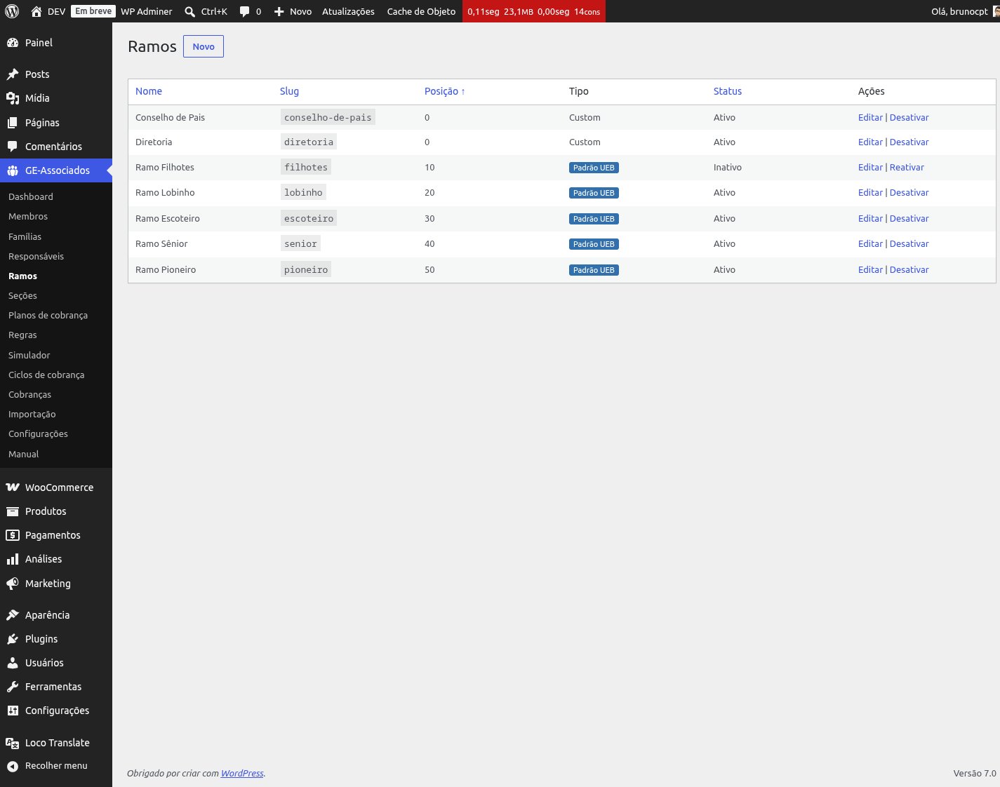
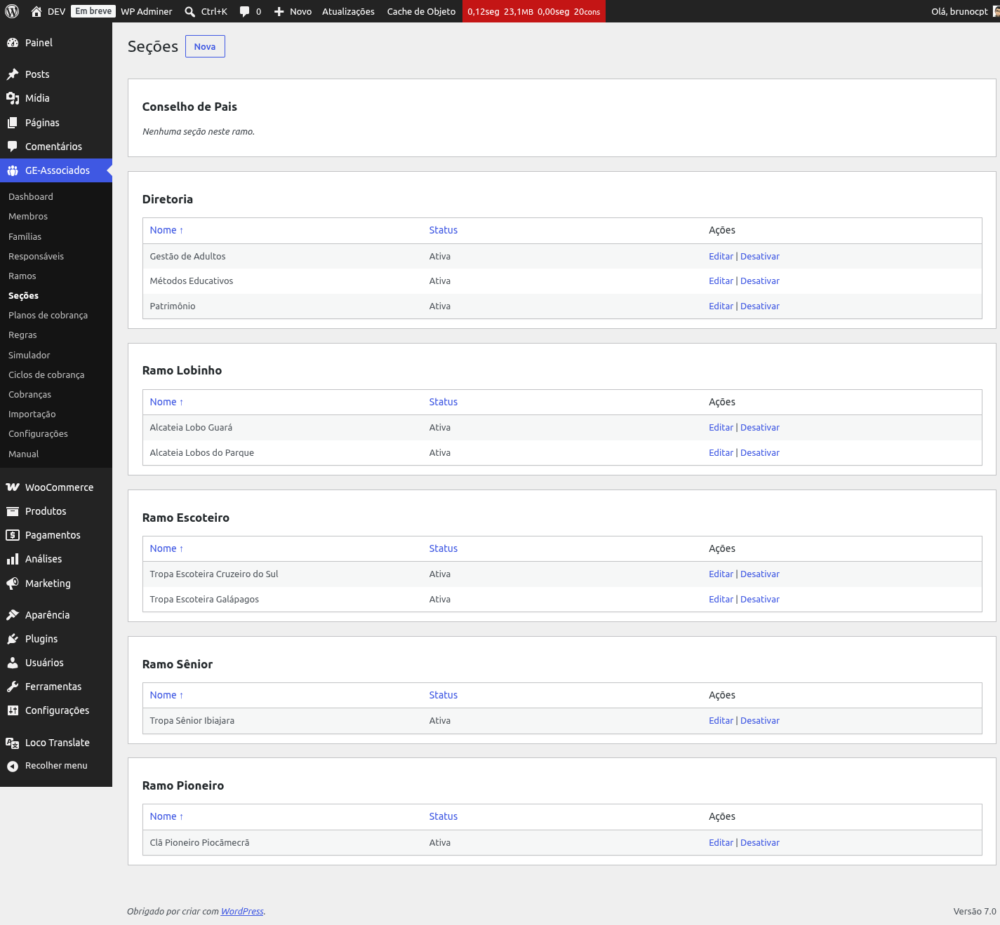

# Ramos e Seções

O plugin distingue dois conceitos:

- **Ramo**: categoria geral oficial (no escotismo brasileiro: Filhotes, Lobinho, Escoteiro,
  Sênior, Pioneiro). Em outras organizações, pode ser "Categoria A", "Categoria B" etc.
- **Seção**: nome customizado pelo grupo, vinculado a um ramo (ex.: "Alcateia Lobos do Parque" é
  uma seção do Ramo Lobinho).

## Ramos

Ao ativar o plugin, os cinco ramos oficiais da UEB são automaticamente cadastrados na sua
organização, marcados com o badge **"Padrão UEB"**. Você pode *desativar* os que não usa (por
exemplo, se o seu grupo não tem Ramo Filhotes), *renomear* qualquer um deles, ou criar novos
ramos customizados.

*Listagem de Ramos. Filhotes desativado (não usado pelo GEJA).*

## Seções

Cada grupo cadastra suas próprias seções e as vincula a um ramo. A listagem é agrupada por ramo,
facilitando a visão.

*Seções organizadas por ramo. Um ramo pode ter várias seções; uma seção pertence a um único
ramo.*

{: .warning }
> Ramos e seções são **desativados**, nunca excluídos. Isso preserva o histórico de cadastros —
> se um membro foi vinculado a uma seção que depois caiu em desuso, ele continua íntegro no
> sistema. Se você excluir manualmente pensando em "limpar" a lista, está apagando errado: use
> sempre desativar.
