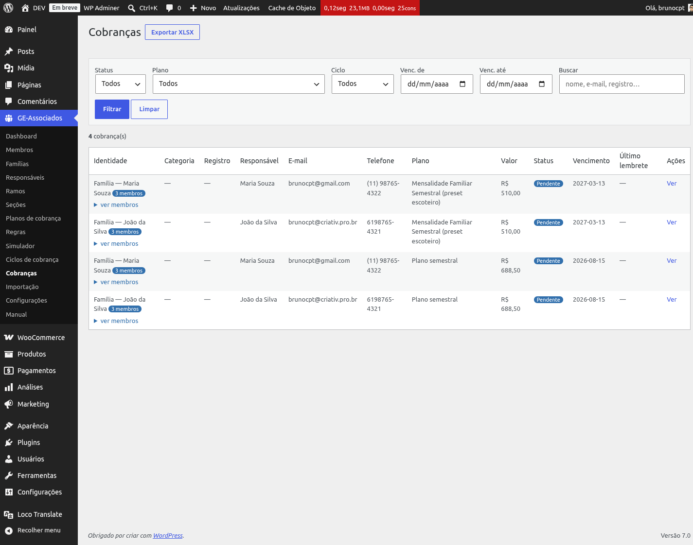
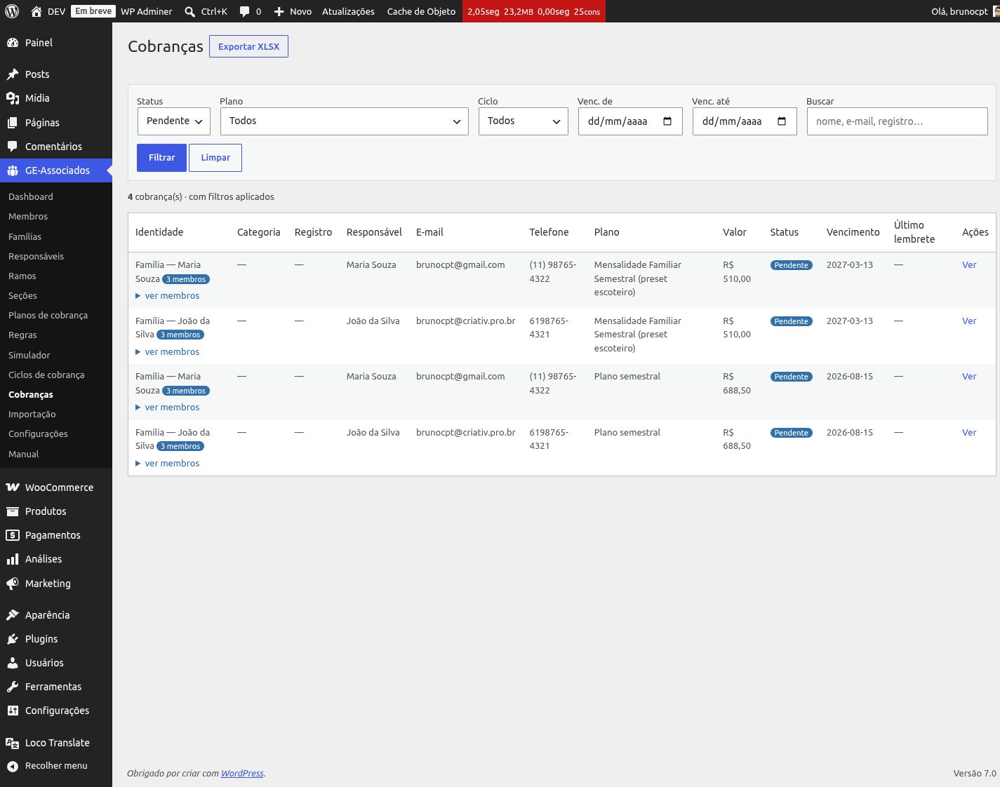
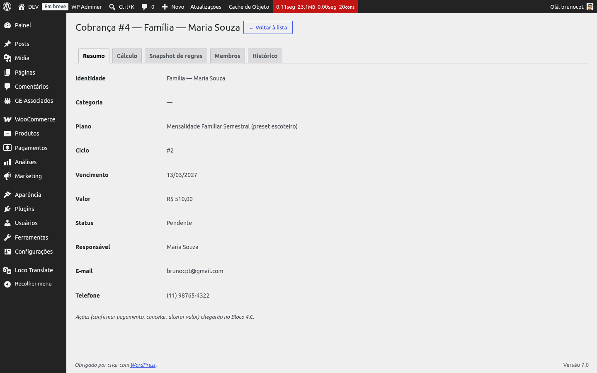
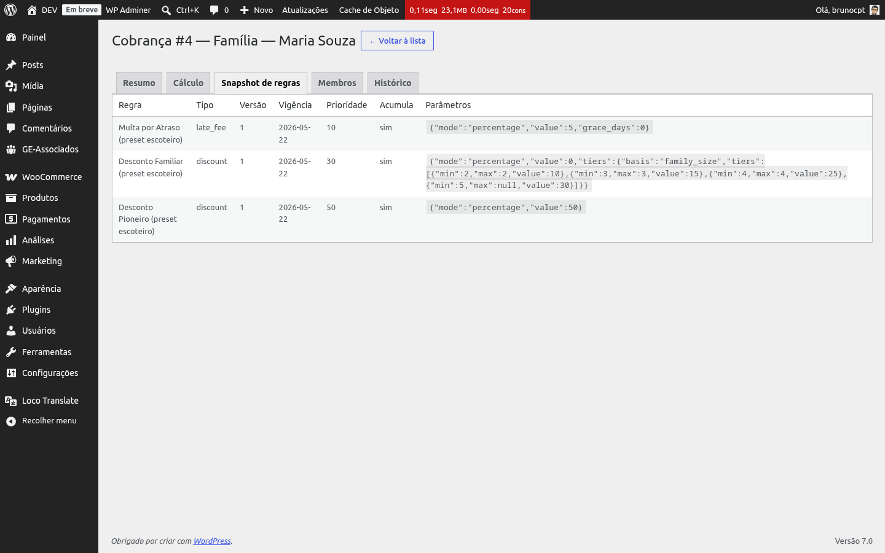
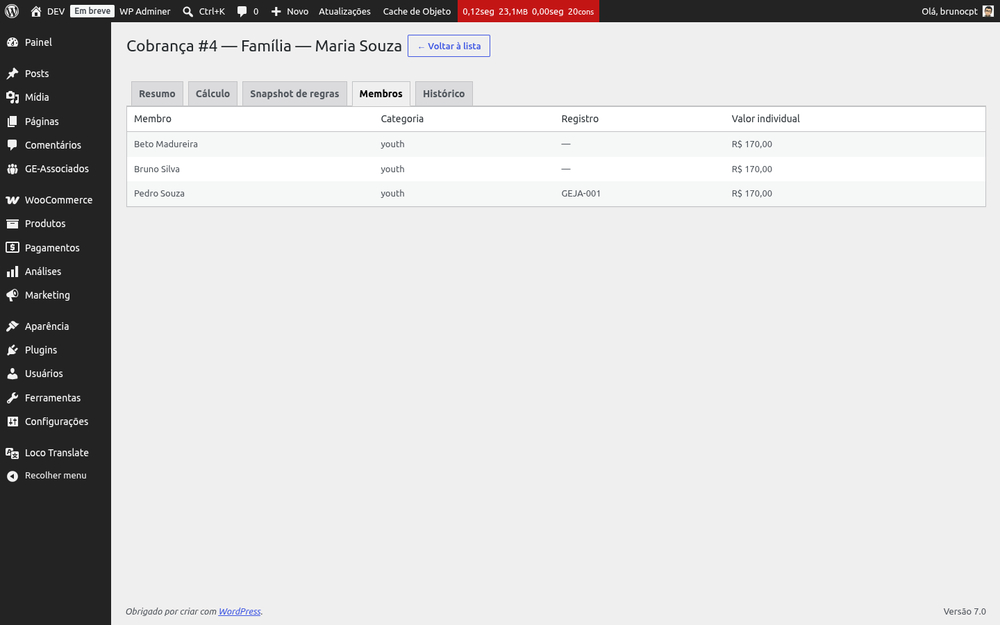
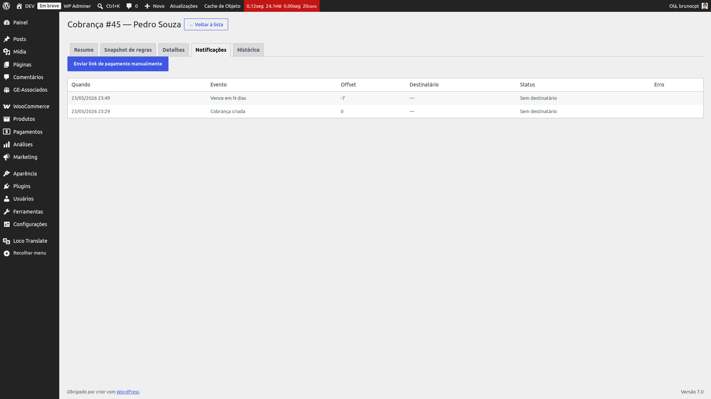
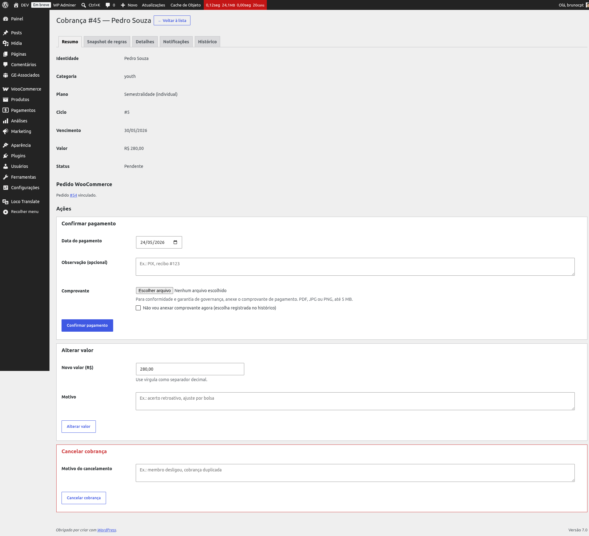
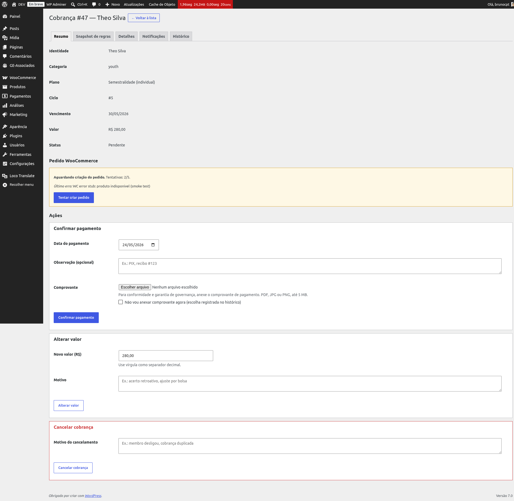

# Painel de cobranças

O **painel de cobranças** em *GE-Associados → Cobranças* é a tela operacional do dia a dia:
lista todas as cobranças da organização (cross-ciclo), com filtros para isolar o que você
precisa ver, e leva à página de detalhe — onde ficam as ações de confirmar pagamento, cancelar e
alterar valor.

*Listagem operacional. Linhas familiares mostram badge "N membros" + expansor inline com cada
membro e seu valor individual.*

## Colunas da listagem

- **Identidade** — em modo individual, o nome do membro; em modo familiar, "Família — Nome do
  Responsável" com badge "N membros" + expansor.
- **Categoria** — tipo do membro (jovem/voluntário). Em famílias mostra "—" e cada membro tem
  sua categoria no expansor.
- **Registro**, **Responsável**, **E-mail**, **Telefone** — dados resolvidos para apresentação.
- **Plano** — o BillingPlan do ciclo a que a cobrança pertence.
- **Valor** — total da cobrança (já com regras aplicadas).
- **Status** — Pendente, Pago, Cancelado, *Aguardando pedido* (criação no WooCommerce falhou —
  ver seção dedicada abaixo) ou *Vencido* (badge vermelho quando é Pendente e a data de
  vencimento já passou).
- **Vencimento**, **Último lembrete**.
- **Ações** — link "Ver" para a tela de detalhe.

## Filtros (combinam livremente)

*Barra de filtros: Status, Plano, Ciclo, Vencimento (de/até) e Busca textual.*

- **Status** — Pendente, Aguardando pedido, Vencido (atalho para pendentes com vencimento
  passado), Pago, Cancelado, ou Todos.
- **Plano** — dropdown com os planos ativos da organização.
- **Ciclo** — dropdown com os ciclos gerados. Pode ser pré-aplicado por drill (link na tela de
  Ciclos).
- **Vencimento de / até** — intervalo de datas.
- **Buscar** — texto livre. Procura no nome do membro, nome do responsável, número de registro e
  e-mail.

## Drill desde a tela de Ciclos

Na tela *Ciclos de cobrança*, a coluna **Cobranças** é um link clicável quando o ciclo já gerou
cobranças. Clicar leva direto para o painel de cobranças com o filtro de ciclo pré-aplicado —
útil quando você quer ver "quem foi cobrado na rodada de janeiro/2026".

## Exportar XLSX

O botão **Exportar XLSX** no header da página gera uma planilha com as cobranças *filtradas
atualmente*. Inclui as 13 colunas em PT-BR e, em cobranças familiares, adiciona linhas
indentadas (`· Nome`) com o valor individual de cada membro coberto — útil para conferência sem
abrir o detalhe.

## Detalhe da cobrança (5 tabs)

Clique em **Ver** em qualquer linha para abrir a tela de detalhe. As abas disponíveis variam
ligeiramente conforme a cobrança é *individual* ou *familiar*:

- **Individual**: Resumo · Snapshot de regras · Detalhes · Notificações · Histórico.
- **Familiar**: Resumo · Snapshot de regras · Membros · Notificações · Histórico (a aba
  "Detalhes" é substituída por "Membros", que já mostra a distribuição do valor entre os membros
  cobertos).

### Aba Resumo

Dados básicos: identidade, categoria, plano, ciclo, vencimento, valor, status, responsável (em
famílias), e-mail e telefone. É também onde ficam os cards de ação (descritos abaixo) e, quando
aplicável, o bloco do pedido WooCommerce vinculado.

*Topo da aba Resumo com os dados da cobrança. Os cards de ação aparecem logo abaixo enquanto a
cobrança estiver pendente.*

### Aba Snapshot de regras

Decodifica o `rule_snapshot_json`: lista *quais* versões de regra estavam vigentes na data de
vencimento daquele ciclo. Mesmo que as regras sejam modificadas depois, a cobrança preserva o
cálculo original — auditoria perfeita.

*Snapshot imutável das regras: cobranças geradas nunca são afetadas por mudanças futuras de
regras.*

### Aba Detalhes (só individual)

Decodifica o `breakdown_json`: subtotal, total e cada linha aplicada (acréscimos, descontos,
multas, créditos), com tipo, label, valor, modo (percentual ou fixo) e taxa.

### Aba Membros (só familiar)

Lista os membros cobertos pela cobrança com nome, categoria, registro e valor individual.
Substitui a aba "Detalhes" nas cobranças familiares.

*A distribuição do valor familiar entre membros (plana por enquanto: total / N membros).*

### Aba Notificações

Mostra o histórico de envios automáticos de notificação para esta cobrança (lembretes
pré-vencimento, aviso de vencido etc.), com data/hora, evento, offset em dias, destinatário,
status e mensagem de erro quando houver. No topo, um botão **Enviar link de pagamento
manualmente** dispara um reenvio sob demanda (útil quando o usuário pediu o link novamente). O
resultado entra no mesmo log.

*Log de envios + botão de reenvio manual no topo.*

### Aba Histórico

Timeline de eventos da cobrança lidos do log de auditoria com tipo `charge`: criação,
confirmação de pagamento, alteração de valor (com valor antes/depois e motivo), cancelamento
(com motivo) e tentativas de criação do pedido WooCommerce. Cada evento mostra data/hora, ação e
o payload registrado.

*Eventos do ciclo de vida em ordem cronológica — base da auditoria.*

## Ações na cobrança (aba Resumo)

Enquanto a cobrança estiver **Pendente**, três cards aparecem na aba Resumo. Cobranças já
*Pagas* ou *Canceladas* exibem só uma nota informando que não há ações disponíveis.

*Confirmar pagamento, Alterar valor e Cancelar cobrança — visíveis enquanto a cobrança está
pendente.*

### Confirmar pagamento

- **Data do pagamento** — pré-preenchida com hoje; aceita data retroativa (útil quando o
  lançamento bancário é registrado dias depois).
- **Observação (opcional)** — texto livre que entra no histórico (ex.: "PIX, recibo #123").
- **Comprovante** — upload de PDF, JPG ou PNG, até 5 MB. O arquivo fica guardado no servidor
  (protegido por controle de acesso próprio) e aparece no bloco *Comprovantes* da própria aba
  Resumo, com link de download autenticado.
- **"Não vou anexar comprovante agora"** — checkbox mutuamente exclusivo com o upload. Quando
  marcado, a escolha fica registrada no histórico para fins de auditoria.

Após confirmar, o status vira *Pago* e um evento de pagamento entra no histórico.

{: .tip }
> Registre sempre uma observação curta ao confirmar (ex.: "PIX 24/03, comprovante enviado por
> WhatsApp") mesmo quando não há comprovante para anexar. Meses depois, ao investigar uma
> divergência, essa linha no histórico costuma ser a única pista de por que a cobrança foi
> confirmada sem arquivo.

### Alterar valor

- **Novo valor (R$)** — aceita vírgula como decimal e ponto como milhar (ou o inverso).
- **Motivo** — obrigatório (ex.: "acerto retroativo", "ajuste por bolsa"). Fica registrado no
  histórico.
- Se o novo valor for igual ao atual, a tela avisa "nada foi alterado" — não gera evento nem
  repete escrita.

### Cancelar cobrança

- **Motivo** — obrigatório, gravado no histórico.
- Confirmação JavaScript antes do envio ("Cancelar essa cobrança? Esta ação não pode ser
  desfeita.").
- Cobranças canceladas saem da soma a receber e não permitem mais ações.

{: .warning }
> Cancelar não tem desfazer pela interface. Se você cancelou por engano, é preciso gerar uma
> cobrança nova (via ciclo, ou ajustando o cadastro e regerando) — não existe um botão
> "reativar".

## Status "Aguardando pedido" (integração WooCommerce)

Quando o WooCommerce está ativo, cada cobrança gerada tenta criar um pedido em modo automático.
Se a criação falhar (ex.: WC temporariamente indisponível, configuração de produto inválida), a
cobrança fica em **Aguardando pedido** em vez de Pendente — separando "cobrança válida sem
pedido vinculado" de "cobrança normal aguardando pagamento".

Na aba Resumo, um bloco amarelo mostra:

- Quantas tentativas já foram feitas (formato `N/5`).
- O último erro retornado pelo WooCommerce.
- Botão **Tentar criar pedido** que dispara uma nova tentativa síncrona.

Existe também um cron diário que reprocessa automaticamente todas as cobranças nesse estado, até
o limite de **5 tentativas** por cobrança. Atingido o limite, o botão some e a tela orienta
verificar a configuração do WooCommerce ou cancelar manualmente. Quando o pedido enfim é criado
(manual ou pelo cron), o status volta para Pendente e o pedido WC aparece linkado.

*Bloco amarelo na aba Resumo: contador de tentativas, último erro e botão de retry manual.*

{: .note }
> **URL compartilhável:** cada detalhe tem URL única. Pode mandar o link para um colega olhar a
> mesma tela sem precisar navegar pelos filtros.
