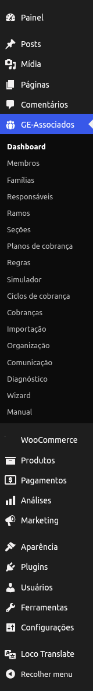
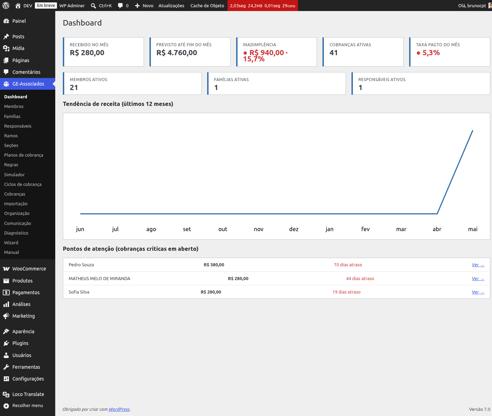
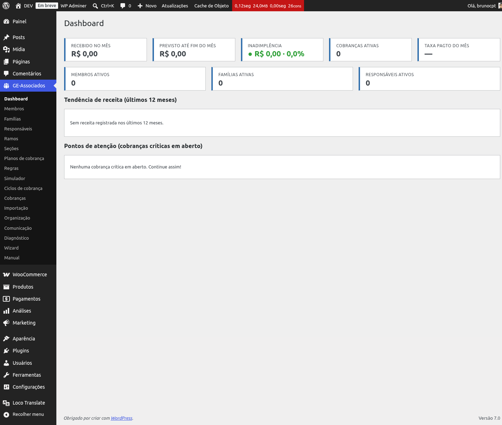

# Dashboard executivo

O **Dashboard executivo** entrega, em uma única tela, a visão financeira e operacional do mês
corrente. Pensado para coordenação e tesouraria: você abre, lê os números e fecha — sem precisar
exportar relatórios. Acesse em **GE Associados → Dashboard**.

*Atalho no menu lateral do admin.*

*Dashboard com dados: 5 KPIs no topo, 3 contadores, tendência de 12 meses e alertas críticos.*

## 5 KPIs do mês corrente

Cinco cartões no topo, lidos da esquerda para a direita:

- **Recebido no mês** — soma de cobranças pagas cuja data de pagamento caiu no mês corrente. É o
  caixa efetivo do mês.
- **Previsto até fim do mês** — soma de cobranças pendentes e aguardando pedido com vencimento
  entre hoje e o último dia do mês. Mostra o que ainda deve entrar até o fechamento.
- **Inadimplência** — valor em R$ + percentual. Soma de cobranças pendentes e aguardando pedido
  com vencimento anterior a hoje (sem corte por mês — atrasos antigos contam). O percentual é
  calculado sobre *recebido + previsto + inadimplência*.
- **Cobranças ativas** — contagem total de cobranças em aberto, independentemente do mês de
  vencimento. Quantidade de itens, não valor.
- **Taxa de pagto do mês** — percentual de *recebido / total cobrado no mês* (todas as cobranças
  com vencimento dentro do mês corrente, em qualquer status). Se não há cobranças no mês, aparece
  um traço (—).

## Semáforos de saúde

Dois KPIs ganham cor de fundo conforme o resultado, ajudando a leitura rápida:

- **Inadimplência**: verde abaixo de 5%, amarelo de 5% a menos de 15%, vermelho a partir de 15%.
- **Taxa de pagto**: verde a partir de 85%, amarelo de 70% a menos de 85%, vermelho abaixo de
  70%.

{: .note }
> Os outros três KPIs (*Recebido*, *Previsto*, *Cobranças ativas*) não têm semáforo — são valores
> absolutos, sem meta universal.

## 3 contadores ativos

Logo abaixo dos KPIs, três contagens da base no momento da consulta:

- **Membros ativos** — membros com status ativo na organização.
- **Famílias ativas** — famílias com pelo menos um membro ativo.
- **Responsáveis ativos** — responsáveis financeiros com famílias ativas.

## Tendência de receita (12 meses)

Gráfico em linha mostrando a receita paga mensal nos últimos 12 meses (mês atual + 11
anteriores). A escala vertical é proporcional ao maior valor do período, e os rótulos no eixo X
usam abreviações em português (jan, fev, mar...).

Se não há nenhuma receita registrada no intervalo, o gráfico é substituído pela mensagem "Sem
receita registrada nos últimos 12 meses." — útil para organizações novas ou recém-importadas.

## Top 5 alertas (cobranças críticas em aberto)

Lista das 5 cobranças em aberto e vencidas mais críticas. A ordenação combina **dias de atraso ×
valor** (descendente) — uma cobrança alta e antiga sobe; uma cobrança pequena e recente desce. Em
empate, ordena por data de vencimento mais antiga e depois por ID.

Cada linha mostra:

- **Quem deve** — nome da família (ou do responsável, se a família não tem nome) ou do membro
  associado.
- **Valor** — valor base da cobrança em R$.
- **Atraso** — dias entre o vencimento e hoje.
- **Ver →** — link direto para a tela de detalhe da cobrança, de onde você pode acionar o
  responsável.

Se nenhuma cobrança está vencida, a área exibe "Nenhuma cobrança crítica em aberto. Continue
assim!".

*Dashboard de organização nova: KPIs zerados, gráfico com mensagem de "sem receita" e área de
alertas limpa.*

## Atualização e performance

O dashboard **não usa cache** — cada acesso dispara as consultas diretamente no banco. Isso
garante que os números refletem o estado real da base, inclusive cobranças marcadas como pagas
há poucos segundos.

{: .tip }
> A performance é adequada para organizações típicas com até cerca de 1.000 cobranças por mês.
> Em bases muito maiores, o carregamento pode demorar alguns segundos — não é travamento, é
> volume de consulta.
