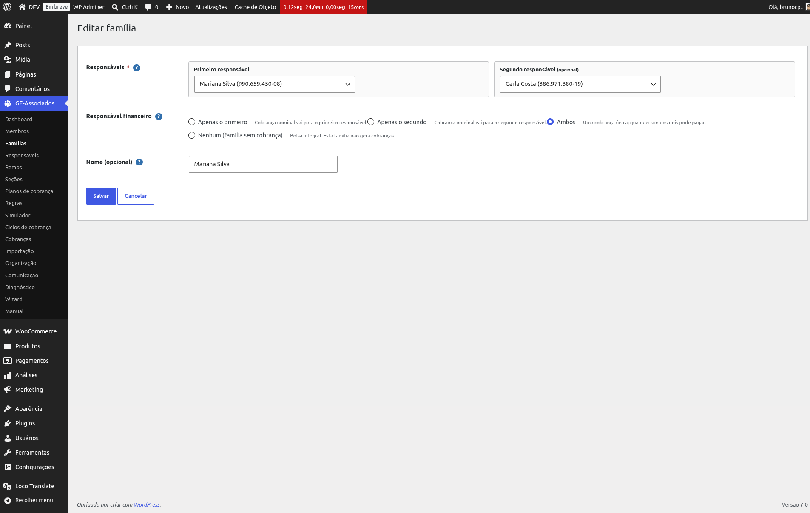
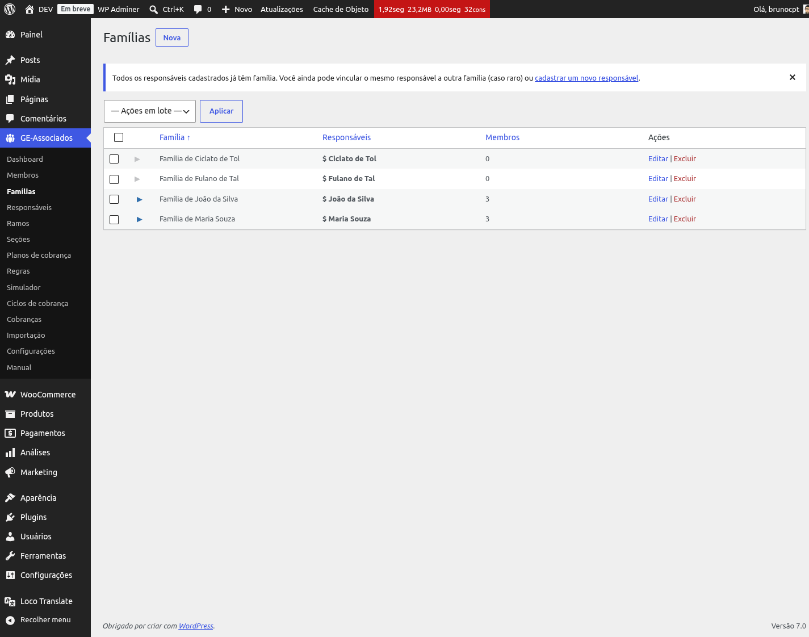
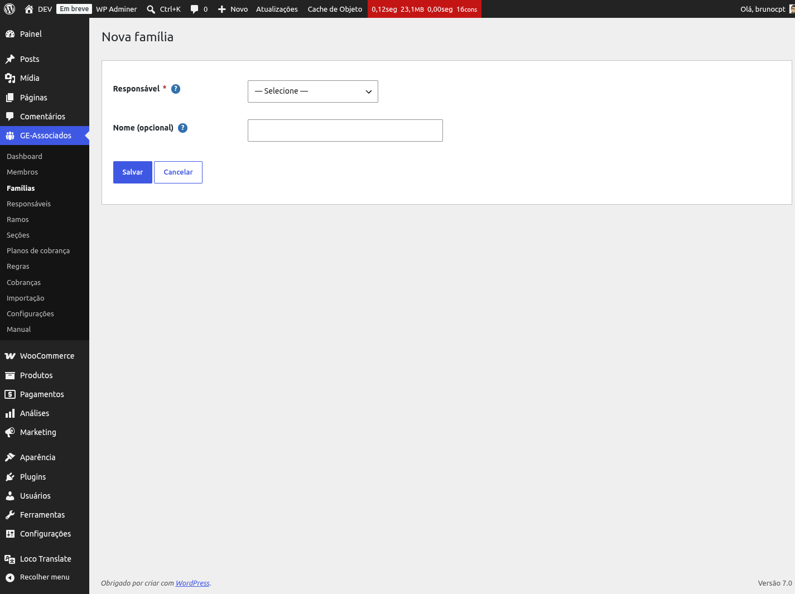

# Famílias

A **família** é o grupo de cobrança. Cada família tem um único responsável financeiro e pode
conter um ou mais membros (jovens). A cobrança é gerada para a família, e o responsável recebe.

## Segundo responsável e quem paga

Cada família tem um **1º responsável** (obrigatório) e pode ter um **2º responsável**
(opcional). O campo **Responsável financeiro** define quem recebe as cobranças:

- **Apenas o 1º** (padrão): cobranças vão só para o R1.
- **Apenas o 2º**: cobranças vão só para o R2 (válido apenas quando o R2 está preenchido).
- **Ambos**: 1 cobrança com 2 destinatários — qualquer um dos dois pode quitar.
- **Nenhum** (sem cobrança): família não gera cobranças. Útil para famílias bolsistas ou casos
  sociais.

O formulário de edição mostra dois cards de responsável lado a lado e habilita as opções
"Apenas o 2º" e "Ambos" apenas quando o 2º responsável é preenchido.

*Cadastro de família com 2 responsáveis e seleção de quem é cobrado.*

*Listagem mostra cada família com nome do responsável e CPF formatado.*

## Criando manualmente

Se você não usou o atalho "Criar família automaticamente" no cadastro do responsável, pode
criar a família depois em **GE-Associados → Famílias → Nova**. O dropdown de responsável mostra
*apenas* os responsáveis que ainda não têm família vinculada — assim você nunca encontra opções
inválidas em uma lista grande.

*Dropdown filtrado de responsáveis sem família. O campo "Nome" da família é opcional.*

{: .warning }
> Se **todos** os responsáveis já têm família, o botão "Nova" desaparece e a listagem orienta a
> cadastrar um novo responsável antes. Se você estava procurando o botão e não achou, é esse o
> motivo — não é bug.

## Por que o nome é opcional

A identificação canônica da família é via CPF do responsável. O campo "Nome" é apenas para
exibição. Em branco, o sistema mostra "Família de [nome do responsável]" — então nunca deixa de
ter um rótulo legível, mesmo que você nunca preencha o campo.
