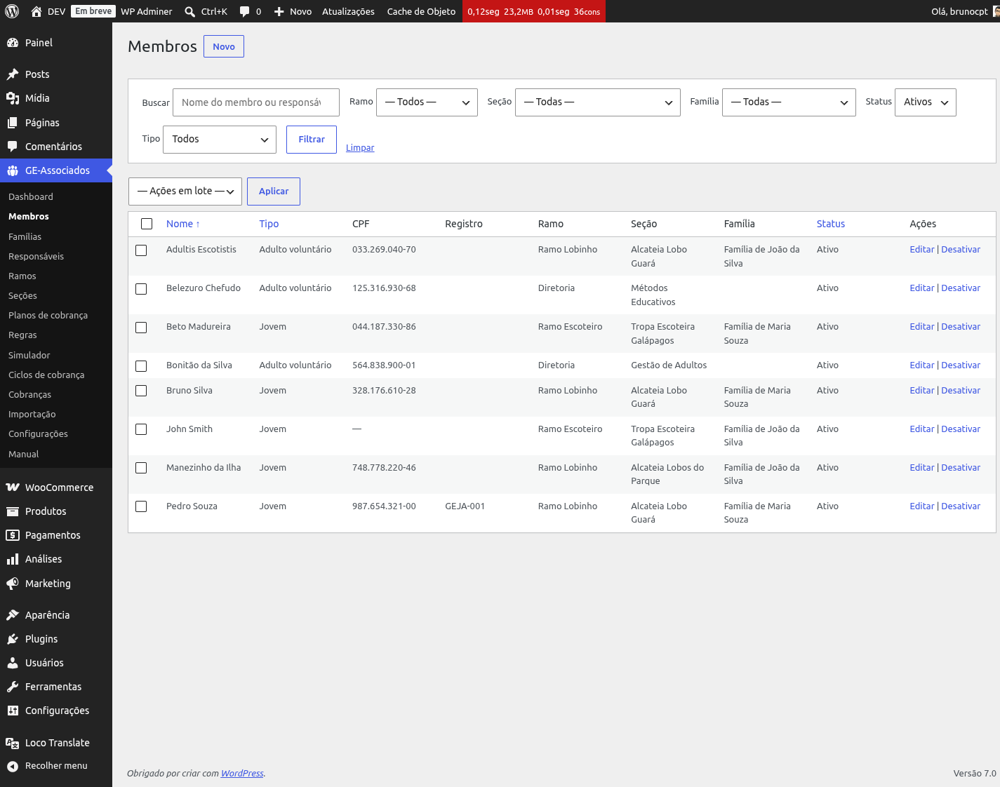
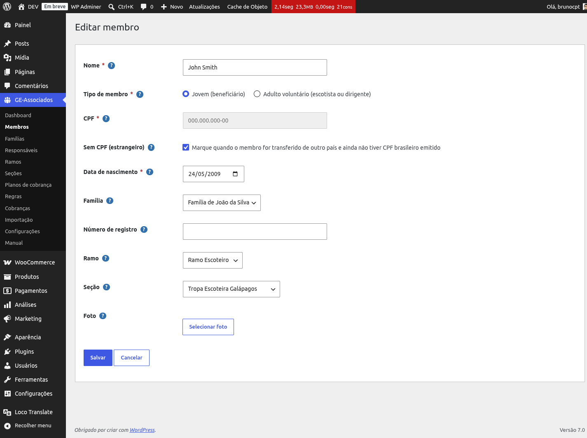
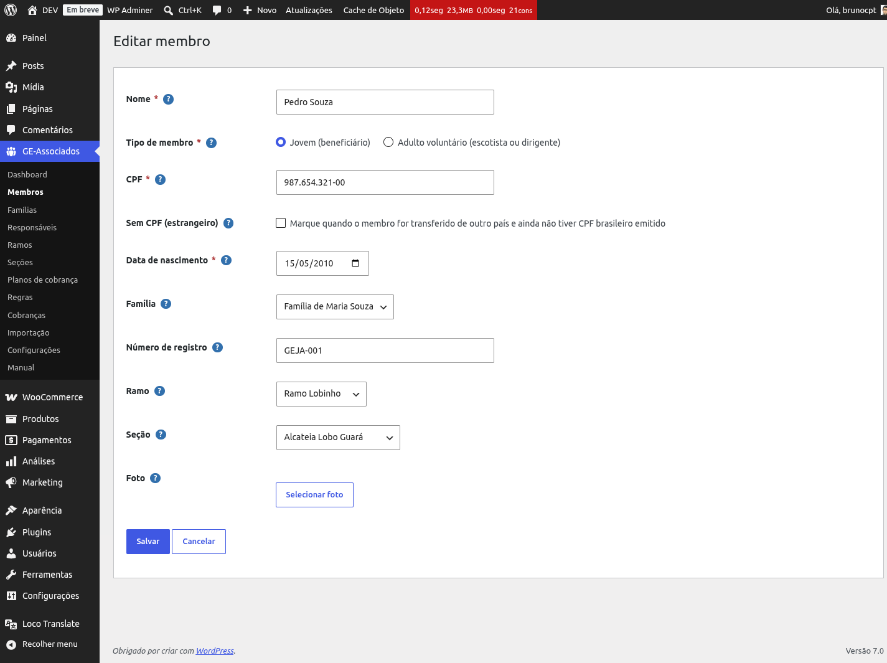
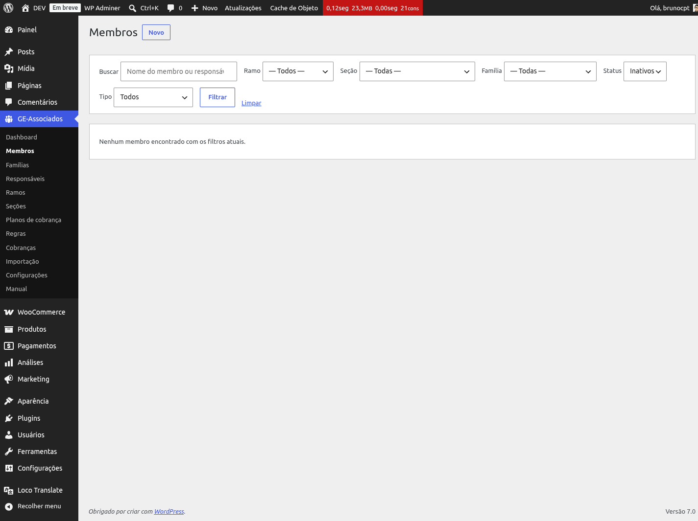

# Membros

Os **membros** são as pessoas atendidas pela organização: jovens (escoteiros, alunos,
associados) e adultos voluntários (escotistas, dirigentes, equipe).

*Listagem com filtros visíveis: busca por nome, ramo, seção, família, status e tipo.*

## Tipo: jovem ou adulto voluntário

Todo membro tem um **tipo**:

- **Jovem (beneficiário)**: o associado principal — escoteiros, lobinhos, pioneiros etc.
- **Adulto voluntário**: escotistas, dirigentes, equipe de apoio.

Essa distinção é importante porque regras de cálculo podem aplicar valores diferentes: no GEJA,
por exemplo, adultos voluntários não pagam taxa. Em outros grupos, pagam metade ou o valor
integral. Ver [Motor de regras](rules-engine).

## CPF: brasileiro ou estrangeiro

O CPF é obrigatório por padrão, com validação de dígitos verificadores. Mas alguns membros vêm
transferidos de outros países e ainda não têm CPF brasileiro. Para esses casos, marque o
checkbox **"Sem CPF (estrangeiro)"**: o campo CPF fica desabilitado e o membro pode ser salvo
sem ele.

*Quando "Sem CPF (estrangeiro)" está marcado, o campo CPF fica desabilitado e o membro é salvo
sem CPF.*

{: .warning }
> Sem marcar o checkbox, salvar um membro sem CPF é rejeitado com a mensagem "CPF obrigatório
> (marque a opção 'Sem CPF' se for membro estrangeiro)." Se o membro é mesmo estrangeiro, marque
> "Sem CPF" — não tente contornar preenchendo um CPF inventado: além de a validação de dígitos
> verificadores poder rejeitar, você estaria gravando um documento que não é da pessoa.

## Ramo, Seção e Família

O membro pode ser vinculado a um **ramo** e uma **seção**. Ao escolher o ramo, o dropdown de
seção atualiza automaticamente mostrando apenas as seções daquele ramo — você não precisa
lembrar qual seção pertence a qual ramo.

A **família** é opcional. Adultos voluntários geralmente ficam sem família e sem ramo (porque
pagam suas próprias taxas e não fazem parte do programa de jovens).

*Form do membro Pedro Souza com Ramo Lobinho e seção dependente.*

## E-mail do membro

O campo **E-mail do membro** é usado pelo módulo de Comunicação para enviar notificações
diretamente ao próprio associado (ex.: confirmação de pagamento, lembrete de vencimento). Pode
ficar em branco — nesse caso, as notificações vão apenas para os responsáveis financeiros da
família.

## Data fim de cobrança

O campo **Data fim de cobrança** corta automaticamente as cobranças de um membro a partir de uma
data específica. Útil quando o membro sai do grupo, completa a maioridade ou pede pausa. Ciclos
com vencimento posterior a essa data não geram cobrança para esse membro (o motivo aparece no
preview do ciclo como "data de fim de cobrança ultrapassada").

{: .tip }
> Prefira sempre preencher **Data fim de cobrança** em vez de desativar o membro na saída — desativar
> some com ele da listagem padrão, mas quem só quer parar de cobrar (mantendo o histórico visível)
> ganha mais controle com a data de corte.

## Desativar (não excluir)

Membros não são excluídos. Quando saem do grupo, você clica em **Desativar** — eles ficam
ocultos da listagem padrão ("Ativos"), mas o histórico de cobranças, presenças e dados continuam
preservados. Para ver inativos, troque o filtro Status para "Inativos"; cada linha mostra um
link **Reativar**.

*Filtro "Status: Inativos" mostra apenas membros desativados, com opção de reativar.*
