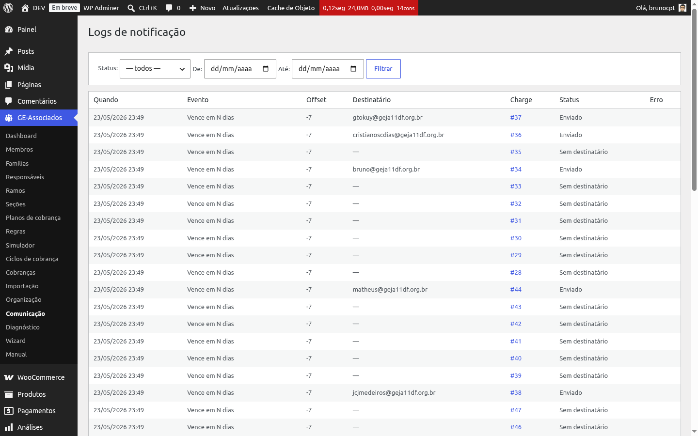

# Histórico de envios

O **histórico de envios** registra *toda* tentativa de notificação — tanto as que foram
entregues quanto as que falharam ou foram ignoradas. É a fonte definitiva para responder "essa
cobrança recebeu lembrete?" ou "por que esse envio não saiu?".

Acesso em **GE Associados → Comunicação → Ver log completo** (link no painel lateral direito da
tela inicial de Comunicação).

*Histórico completo com filtros (Status, De, Até) e paginação. A coluna Cobrança é clicável e
leva ao detalhe.*

## O que aparece em cada linha

- **Quando** — data e hora do envio (ou da gravação, quando o envio foi pulado), no formato
  `dd/mm/aaaa HH:mm`.
- **Evento** — qual dos 10 eventos disparou aquele envio (ver
  [Templates de e-mail](notification-templates)).
- **Offset** — em eventos do cron, dias antes/depois do vencimento; nos eventos por ação, fica em
  0.
- **Destinatário** — e-mail real que recebeu (ou que receberia, em caso de falha). Em envios sem
  destinatário, mostra "—".
- **Cobrança** — link *#N* para o detalhe da cobrança correspondente.
- **Status** — um dos quatro valores possíveis (ver abaixo).
- **Mensagem** — em envios não-OK, o motivo (ex.: "duplicate", "template ausente", "falha de
  envio").

## Os 4 status possíveis

- **Enviado** — o e-mail saiu com sucesso. Em provedores externos via integração customizada,
  significa que o provedor aceitou a mensagem (não que o destinatário leu).
- **Falhou** — o envio retornou falha. Geralmente indica problema de SMTP, endereço inválido ou
  bloqueio do servidor de e-mail. Verifique o log do plugin SMTP e a coluna *Mensagem* da linha.
- **Ignorado** — o plugin decidiu *não* enviar por uma das três razões: toggle global desligado
  ("notificações desabilitadas"), template inexistente ou inativo ("template ausente") ou
  anti-dedup intra-dia ("duplicate"). Ver "Anti-dedup" abaixo.
- **Sem destinatário** — a cobrança não tem destinatário válido. Causas típicas: família com
  responsável financeiro "Nenhum" (sem cobrança), responsável sem e-mail cadastrado, membro jovem
  menor de 18 sem família vinculada. Corrija o cadastro e use o reenvio manual.

## Filtros disponíveis

A barra de filtros no topo da página permite combinar:

- **Status** — dropdown com os 4 valores acima ou "— todos —".
- **De / Até** — intervalo de datas. Útil para "envios de janeiro" ou "tudo da última semana".

Os filtros mantêm o estado na URL (você pode compartilhar o link de uma consulta específica).
Paginação automática a cada 50 envios.

## Anti-dedup intra-dia (motivo "Ignorado" mais comum)

Antes de enviar, o plugin verifica se *aquela combinação* (cobrança + evento + offset) já foi
enviada *hoje*. Se sim, o envio é registrado como **Ignorado** com motivo "duplicate" e o e-mail
não sai. Isso protege contra:

- Múltiplas execuções do cron no mesmo dia (configuração agressiva, ou plugin de cron
  alternativo).
- Cliques repetidos no botão "Enviar link de pagamento manualmente" no detalhe da cobrança.
- Eventos de webhook duplicados do WooCommerce (alguns gateways disparam a confirmação de
  pagamento mais de uma vez).

O lock é por *data* (no fuso do servidor WordPress), não por janela de horas — uma cobrança pode
receber o mesmo evento amanhã sem problema. O reenvio manual pelo detalhe da cobrança usa um
*bypass* opcional do anti-dedup quando necessário.

## Botão "Reenviar"

O reenvio sob demanda **não fica nesta tela** — fica na *aba Notificações da página de detalhe
da cobrança*. Lá, no topo, há o botão **Enviar link de pagamento manualmente**, que dispara o
evento de reenvio manual e o resultado entra normalmente neste log. Acesse o detalhe pelo link na
coluna *Cobrança* de qualquer linha.

{: .tip }
> **Diagnosticar uma reclamação rápida.** Pegue o e-mail do responsável, filtre por Status
> "Falhou" ou "Sem destinatário" no intervalo recente e cheque a coluna *Mensagem*. Quase sempre
> o motivo está ali — e o link *#N* leva direto à cobrança para corrigir o cadastro e reenviar
> manualmente.
