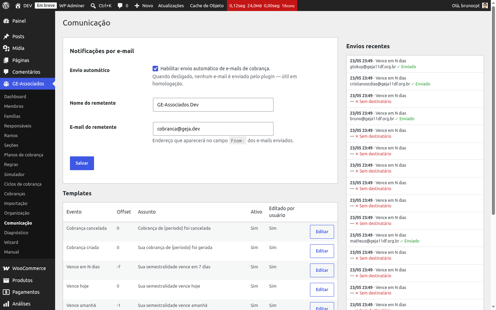

# Configurações de notificação

A tela **GE-Associados → Comunicação** reúne as três áreas do módulo de notificações:
configurações gerais (esta seção), templates de e-mail e histórico de envios. As configurações
gerais ficam no topo da página e definem se o plugin envia e-mails e como o remetente aparece
para o destinatário.

*Bloco de configurações no topo da página Comunicação: toggle global, nome e e-mail do
remetente.*

## Os três campos

- **Envio automático** (toggle global) — quando desligado, o plugin *não envia nenhum e-mail*,
  mesmo que existam templates ativos e eventos sendo disparados. Cada tentativa de envio é
  registrada no log com status *Ignorado* e motivo "notificações desabilitadas". Útil em
  ambientes de homologação, durante migração de dados ou enquanto você ajusta os templates
  iniciais. Vem desligado por padrão.
- **Nome do remetente** — texto exibido antes do e-mail no cabeçalho De: (ex.: "GEJA
  Financeiro"). Em branco, o cabeçalho usa apenas o endereço.
- **E-mail do remetente** — endereço que aparece no campo De:. Em branco, o plugin não força um
  remetente e deixa o WordPress aplicar o padrão (geralmente um endereço genérico do domínio) —
  recomenda-se sempre preencher um e-mail real da organização para não cair em spam.

## Canal único: e-mail

Atualmente o único canal de envio é o **e-mail**, despachado pela função nativa de e-mail do
WordPress. Isso significa que a entrega depende da configuração de SMTP do seu servidor — em uma
instalação WordPress padrão, o servidor PHP usa um envio local que costuma ter baixa
entregabilidade. Para ambientes de produção, instale um plugin de SMTP (WP Mail SMTP, FluentSMTP
etc.) e configure um provedor transacional como remetente.

{: .warning }
> Sem um plugin de SMTP configurado, os e-mails de cobrança podem sair — e o log mostrar "Enviado" —
> mas cair em spam ou nem chegar, porque o servidor de e-mail do WordPress puro não tem boa
> reputação de entrega. "Enviado" no log significa que o WordPress aceitou enviar, não que o
> destinatário recebeu. Se houver reclamações recorrentes de "não chegou", o primeiro suspeito é
> a falta de SMTP configurado, não um bug no plugin.

## Integração com provedor externo (para quem mexe em código)

Se a sua equipe técnica precisar plugar um provedor transacional via API (Mailgun, Postmark,
Resend, SES etc.) sem passar pelo envio nativo do WordPress, o plugin expõe o filtro
`gea_send_email`. Ele recebe o objeto de destinatários, o conteúdo renderizado (assunto, HTML,
texto), a cobrança e o evento, e deve retornar `true` (entregue) ou `false` (falha). O resultado
entra normalmente no log de envios. Isso é assunto de desenvolvimento, não de operação do
dia a dia — repasse para quem mantém o código do site.

## WooCommerce envia e-mails próprios — o GE-Associados suprime os duplicados

Cada cobrança vira um pedido WooCommerce, e o WC tem seus próprios e-mails de cliente (fatura, em
processamento, em espera, concluído, estorno). Para evitar dois e-mails ao responsável sobre o
mesmo evento, o plugin suprime automaticamente os e-mails do WC que duplicariam os nossos. A
regra está descrita em detalhe em
[Templates de e-mail → Supressão de e-mails do WooCommerce](notification-templates).

{: .tip }
> **Resumo prático.** Em produção: ligue o toggle, preencha nome e e-mail do remetente, instale
> um plugin SMTP confiável. Em homologação: deixe o toggle desligado para evitar enviar e-mails
> de teste para responsáveis reais.
