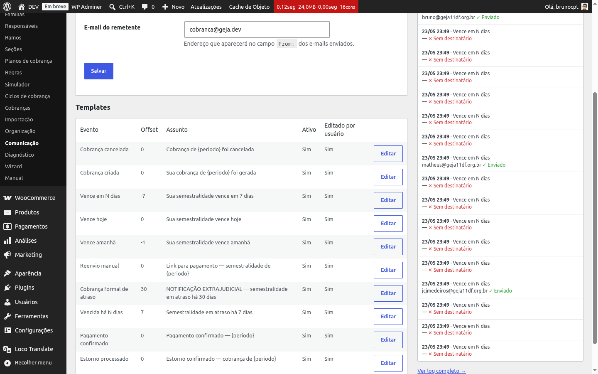
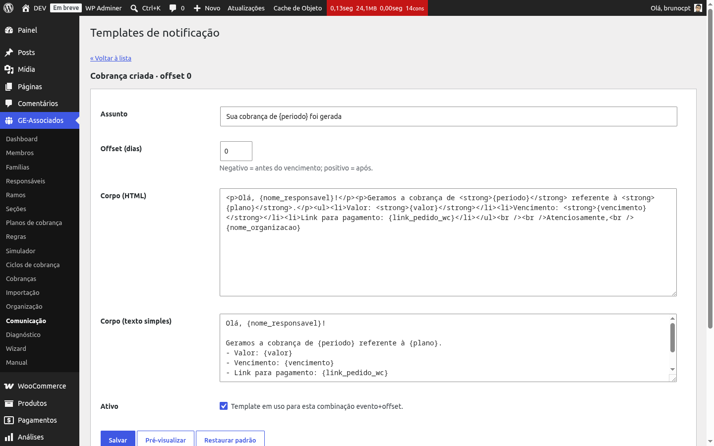

# Templates de e-mail

Os **templates de e-mail** definem o conteúdo de cada mensagem que o plugin envia. Acesso em
**GE Associados → Comunicação** (na seção "Templates", abaixo das configurações) ou diretamente
em *Editar* ao lado de cada linha.

*Listagem dos templates por evento + offset. A coluna "Editado por usuário" sinaliza quais foram
personalizados em relação ao padrão.*

## Os 10 eventos cobertos

Cada template está associado a um **evento**. O plugin entrega 10 eventos, divididos em dois
disparos:

**Disparados por ação (5 eventos)** — saem no momento em que algo acontece na cobrança:

- **Cobrança criada** (`charge_created`) — após a geração do ciclo, uma vez por cobrança.
  Tipicamente carrega o link de pagamento.
- **Reenvio manual** (`manual_link`) — quando o admin clica em "Enviar link de pagamento
  manualmente" no detalhe da cobrança (aba Notificações).
- **Pagamento confirmado** (`payment_confirmed`) — quando o WooCommerce confirma o pagamento via
  gateway.
- **Cobrança cancelada** (`charge_cancelled`) — quando a cobrança é cancelada (no admin ou via
  WC).
- **Estorno processado** (`refund_processed`) — quando um pedido WC é estornado.

**Disparados pelo cron diário (5 eventos)** — varredura uma vez por dia, dispara para cobranças
que se enquadram naquele dia:

- **Vence em N dias** (`due_in_n_days`) — lembrete pré-vencimento com offset configurável (ex.: 7
  dias antes).
- **Vence amanhã** (`due_tomorrow`) — lembrete fixo para o dia anterior ao vencimento.
- **Vence hoje** (`due_today`) — lembrete no dia do vencimento.
- **Vencida há N dias** (`overdue_n_days`) — aviso de atraso com offset configurável (ex.: 3 dias
  após o vencimento).
- **Cobrança formal de atraso** (`overdue_formal`) — cobrança formal mais incisiva, normalmente
  com offset maior (ex.: 30 dias).

## Offset configurável (chave única por offset)

Os 5 eventos do cron aceitam um campo **Offset (dias)** que determina quantos dias antes
(negativo) ou depois (positivo) do vencimento o lembrete sai. A chave única do template é
*(organização, evento, canal, offset)* — você pode ter **vários templates do mesmo evento com
offsets diferentes**. Exemplo: dois templates de `due_in_n_days`, um com offset -7 (uma semana
antes) e outro com offset -3 (três dias antes).

Para os 5 eventos disparados por ação, o offset não tem efeito — o evento é único por cobrança.

## Os 10 placeholders disponíveis

Dentro do *Assunto* e do *Corpo* (HTML ou texto simples), use as marcações abaixo entre chaves
simples. O renderizador substitui pelo valor real da cobrança no momento do envio:

| Placeholder | O que substitui |
|---|---|
| `{nome_membro}` | Nome do membro (em cobrança individual). Vazio em cobranças familiares. |
| `{nome_responsavel}` | Nome do 1º responsável financeiro da família. |
| `{valor}` | Valor base da cobrança formatado em reais (ex.: `R$ 150,00`). |
| `{vencimento}` | Data de vencimento no formato `dd/mm/aaaa`. |
| `{periodo}` | Período de referência do ciclo (ex.: `Junho/2026` quando o ciclo é `2026-06`). |
| `{plano}` | Nome do plano de cobrança (ex.: "Mensalidade Familiar Semestral"). |
| `{link_pedido_wc}` | Link do pedido WooCommerce vinculado. Quando não houver pedido, mostra "Não disponível". |
| `{nome_organizacao}` | Nome da organização configurado em Configurações. |
| `{linhas_membros}` | Em cobranças familiares, lista `- Nome: R$ valor` por membro coberto. Vazio em cobranças individuais. |
| `{destinatario}` | E-mail do destinatário daquele envio (útil para personalização no rodapé). |

Além desses 10, os templates que mencionam link de pagamento também aceitam
`{regras_vigentes}` — lista as regras do snapshot da cobrança em texto legível (ex.: "Pagamento
Antecipado: desconto de 5% se pago até 10 dias antes"), para o responsável saber de antemão
quais descontos ele ganha pagando em dia e quais multas incidem em atraso.

{: .note }
> Para integrações que precisem de placeholders extras (ex.: número de matrícula, observação
> custom da família), quem mantém o código do site pode estender o contexto de renderização
> pelo filtro `gea_email_template_context` antes de o template ser processado.

## Editar um template

Clique em *Editar* em qualquer linha da listagem. O formulário tem cinco campos:

- **Assunto** — texto curto exibido na linha de assunto do e-mail. Aceita placeholders.
- **Offset (dias)** — para eventos do cron. Negativo = antes do vencimento; positivo = após.
  Ignorado nos 5 eventos por ação.
- **Corpo (HTML)** — corpo principal da mensagem. Aceita HTML básico e placeholders.
- **Corpo (texto simples)** — fallback para clientes de e-mail que não renderizam HTML. Aceita
  placeholders.
- **Ativo** — checkbox. Quando desmarcado, esse template não é selecionado mesmo que o evento
  dispare (e a supressão condicional dos e-mails do WC também não aplica para esse evento — ver
  abaixo).

*Formulário de edição com Assunto, Offset, Corpo HTML, Corpo texto e checkbox Ativo. Botões:
Salvar, Pré-visualizar e Restaurar padrão.*

## Pré-visualizar e Restaurar padrão

- **Pré-visualizar** — renderiza o template com dados de exemplo (João Silva, R$ 150,00,
  vencimento fictício etc.) e mostra o resultado abaixo do formulário antes de salvar.
- **Restaurar padrão** — disponível apenas para templates que foram editados pelo usuário.
  Restaura assunto, corpo e offset para os valores entregues de fábrica pelo plugin. Mudanças
  não salvas são perdidas; pede confirmação antes de aplicar.

{: .tip }
> Use sempre **Pré-visualizar** antes de salvar um template editado — é rápido de esquecer um
> placeholder mal digitado (ex.: `{vencimeto}` em vez de `{vencimento}`), e sem pré-visualização
> o erro só aparece quando o responsável recebe o e-mail com a marcação crua no texto.

{: .note }
> Os 10 templates padrão são criados automaticamente na ativação do plugin (e em organizações
> novas). Você não precisa criar nenhum template do zero — apenas ajustar tom, assinatura e
> visual ao gosto da organização.

## Supressão de e-mails do WooCommerce

O WooCommerce envia seus próprios e-mails para o cliente em pontos do ciclo do pedido — alguns
deles cobrem os mesmos eventos que o plugin já cobre. Para evitar duplicação, o plugin
**suprime** certos e-mails do WC apenas para pedidos originados do GE Associados (pedidos de
outras origens continuam normais). A regra é:

**Sempre suprimidos (2 e-mails)** — quando o pedido é GE Associados:

- E-mail de fatura do WC — sinônimo do nosso fluxo manual via *Reenviar link*. Suprimido sempre
  para não duplicar.
- E-mail de estorno do WC — coberto pelo nosso evento de estorno processado. Suprimido sempre.

**Suprimidos condicionalmente (3 e-mails)** — apenas quando o toggle global está ligado *e*
existe template GEA ativo para o evento equivalente:

- E-mail de "pedido em processamento" do WC — equivale ao "Cobrança criada" (offset 0).
- E-mail de "pedido em espera" do WC — também equivale ao "Cobrança criada".
- E-mail de "pedido concluído" do WC — equivale ao "Pagamento confirmado".

Quando o toggle está desligado, ou quando o template GEA equivalente está desativado, o e-mail
do WC passa normalmente — funciona como fallback para o cliente não ficar sem aviso. E-mails
administrativos do WC (que vão para o administrador da loja) **nunca** são suprimidos — eles não
duplicam o fluxo do plugin.

{: .warning }
> Se você desativar um template GEA achando que "assim ninguém recebe e-mail nesse evento",
> lembre que o WooCommerce pode voltar a mandar o e-mail dele nesse mesmo evento — a supressão
> condicional depende do template GEA estar ativo. Para realmente parar todo e-mail, use o
> toggle global em [Configurações de notificação](notification-settings).
