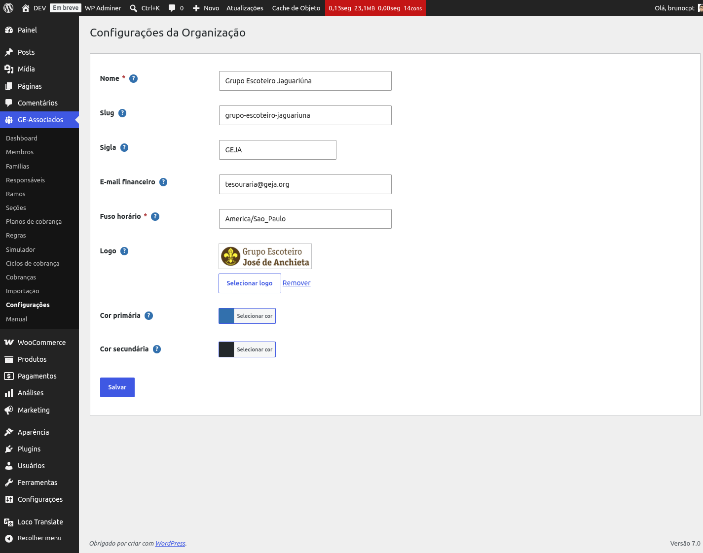

# Configurando a Unidade Escoteira

A primeira coisa a fazer ao instalar o plugin é abrir **GE Associados → Configurações** e
preencher os dados básicos da sua Unidade Escoteira. Esses dados são usados em comunicações, recibos e
cabeçalhos do admin — errar aqui significa e-mail saindo com o nome errado ou sem remetente
identificável para os responsáveis financeiros.

*Tela de Configurações preenchida com dados do GEJA.*

## Campos disponíveis

- **Nome** (obrigatório) — nome completo da Unidade Escoteira, como aparece em comunicações.
- **Slug** — identificador interno em URLs. Se deixar em branco, é gerado automaticamente a
  partir do nome.
- **Sigla** — versão curta (ex.: "GEJA"). Aparece em locais com espaço reduzido.
- **E-mail financeiro** — destino padrão de notificações financeiras e relatórios.
- **Fuso horário** (obrigatório) — identificador IANA, ex.: `America/Sao_Paulo`. Usado em datas
  e relatórios.
- **Logo** — selecione uma imagem da biblioteca de mídia do WordPress. É exibida em algumas
  telas administrativas.
- **Cor primária** e **Cor secundária** — opcionais. Quando definidas, são aplicadas ao admin do
  plugin. Em branco, o plugin herda automaticamente a paleta do tema WordPress ativo.

{: .note }
> **Asterisco vermelho** indica campos obrigatórios. Todos os outros podem ficar em branco e ser
> preenchidos depois — nada aqui trava o uso do resto do plugin.
