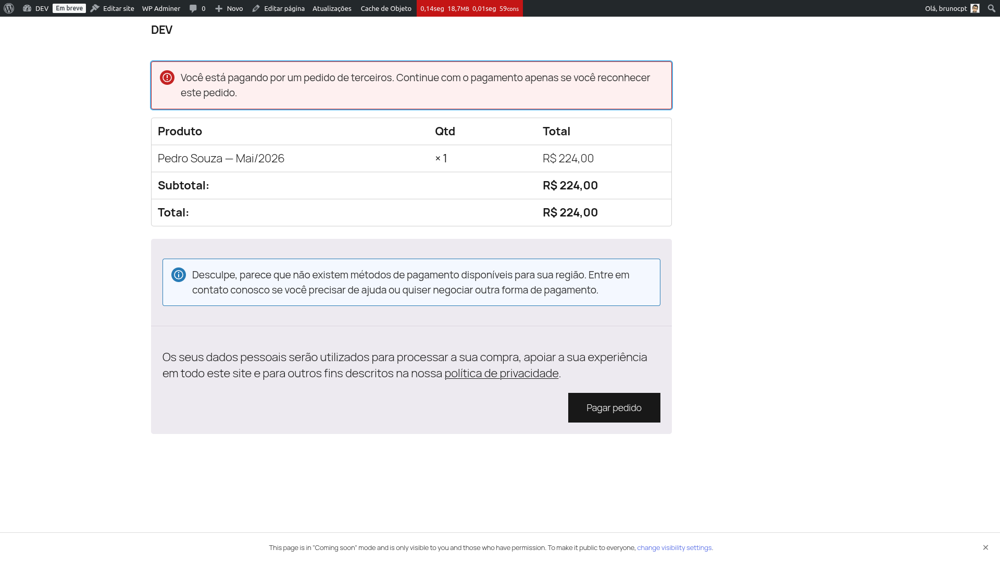

# Link de pagamento

Cada cobrança vira um pedido WooCommerce com um **link de pagamento público**. Esse link é
gerado pelo WooCommerce e enviado ao responsável financeiro pelo módulo de Comunicação (ou
copiado manualmente do detalhe da cobrança quando necessário).

O responsável abre o link, vê o resumo do pedido e escolhe um dos gateways ativos para pagar.
Não precisa de login no WordPress, não precisa de cadastro — é um checkout direto, como qualquer
pedido de loja.

## Recálculo dinâmico ao abrir o link

O diferencial está no que acontece *antes* do cliente ver o valor. Toda vez que alguém abre o
link de pagamento, o plugin intercepta a página e recalcula o valor de cada linha do pedido
**antes de ela renderizar**. O cliente sempre vê o valor correto para o momento em que está
pagando — não o valor congelado de quando a cobrança foi gerada.

O recálculo combina três insumos:

- **Snapshot congelado na geração** — as regras vigentes na data de geração do ciclo. Alterações
  nas regras posteriores não afetam o cálculo.
- **Contexto atual do membro e da família** — idade, seção, ramo, status, tamanho atual da
  família. Se a família cresceu desde a geração, o desconto familiar maior é aplicado
  automaticamente. Se um membro virou inativo, ele sai da conta.
- **Data atual** — usada para avaliar a janela do desconto antecipado e detectar atraso.

## Regras aplicadas dinamicamente

- **Desconto pagamento antecipado (EARLY_PAYMENT_DISCOUNT)** — se a data atual está dentro da
  janela "dias antes do vencimento" configurada na regra, o desconto incide sobre o valor base.
  Fora da janela, o cliente vê o valor cheio.
- **Multa por atraso (LATE_FEE)** — só aplica quando a data atual já passou do vencimento. No dia
  exato do vencimento ainda não há atraso.
- **Desconto/Acréscimo/Crédito** — reaplicados com base no contexto atual e respeitando faixas
  (tiers) por tamanho de família.
- **Isenção (WAIVER)** — se aplicada, zera o total e curto-circuita as demais regras.

*Cliente abriu o link 4 dias antes do vencimento: o desconto antecipado de 5% foi aplicado
dinamicamente.*

*Mesma cobrança aberta fora da janela: o desconto antecipado não aplica e o valor cheio aparece.*

{: .tip }
> Se um responsável reclamar que "o valor mudou entre um dia e outro", quase sempre é isso: ele
> abriu o link fora da janela do desconto antecipado, ou passou a data de vencimento e a multa
> entrou. Confira a data de abertura contra a janela configurada na regra
> (ver [Motor de regras](rules-engine)) antes de supor erro de sistema.

## Falha silenciosa: nunca quebra a página

Se algo inesperado acontecer durante o recálculo (regra mal formada, erro de banco, exceção de
domínio), o erro é capturado e o cliente vê o valor original já gravado no pedido. Em hipótese
alguma uma página pública é quebrada por uma falha do recálculo — é melhor cobrar um valor
desatualizado do que mostrar um erro para o responsável financeiro.

{: .note }
> Cobranças já *Pagas* ou *Canceladas* não passam por recálculo — os valores finais já estão
> consolidados e qualquer mudança a posteriori seria incorreta.

Veja também: [Motor de regras → Desconto pagamento antecipado](rules-engine) para a configuração
detalhada da janela e do modo (percentual ou fixo).
