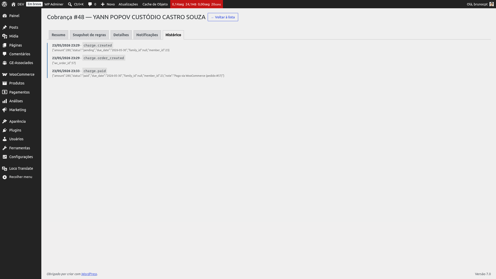

# Confirmação de pagamento

Quando o gateway de pagamento confirma a transação no WooCommerce, o plugin fecha o ciclo de
vida da cobrança de forma idempotente — ou seja, pode ser acionado mais de uma vez para o mesmo
pedido sem cobrar nem baixar duas vezes.

## O que acontece na confirmação

1. **Recálculo final** — uma última passada do motor de regras com a data e o contexto do
   momento do pagamento. Garante que o breakdown reflita o cenário real do pagamento (descontos
   antecipados aplicados, atrasos contabilizados, isenções ativas).
2. **Persistência do breakdown** — o resultado é gravado como o detalhamento final da cobrança.
   Esse breakdown é a *auditoria definitiva*: as abas *Detalhes* (individual) e *Membros*
   (familiar) leem dele.
3. **Atualização dos valores individuais (familiar)** — em cobranças familiares, o valor de cada
   membro é atualizado com o total do breakdown daquele membro. Assim a distribuição interna
   fica correta mesmo quando regras por idade fazem cada membro pagar um valor distinto.
4. **Mark paid** — a cobrança transiciona para status *Pago* e a data de pagamento recebe o
   timestamp do pagamento.
5. **Auditoria** — os eventos de pagamento e (no momento da criação do pedido) de criação de
   pedido ficam registrados e visíveis na aba Histórico do detalhe da cobrança.

{: .note }
> Se o recálculo final falhar (regra inválida, exceção de domínio), o breakdown anterior é
> preservado e a cobrança ainda assim é marcada como Paga. O pagamento já foi confirmado pelo
> gateway — o plugin nunca rejeita a conclusão por causa de falha no recálculo (best-effort).

## Idempotência: pagamento duplicado não cobra duas vezes

O WooCommerce, dependendo do gateway, pode disparar a confirmação de pagamento mais de uma vez
para o mesmo pedido (retentativas, webhooks duplicados, troca de status manual no admin). O
plugin trata isso de forma defensiva: se a cobrança já está em status *Pago*, a segunda
tentativa **não altera nada** — apenas grava um registro de tentativa duplicada no histórico,
para rastreabilidade. Não há dupla baixa nem alteração da data de pagamento.

## Refund: vira Cancelada, não "Pago revertido"

Quando um pedido WC entra em status *estornado* (refund total), o plugin marca a cobrança como
**Cancelada** — não existe um status "pago revertido". O motivo registrado no histórico
identifica que veio de um estorno via WooCommerce, o que permite que o módulo de Comunicação
envie um e-mail diferenciado de estorno sem duplicar mensagens de cancelamento comum.

Pedidos em status *cancelado* seguem o mesmo caminho de marcar a cobrança como *Cancelada*, mas
com a origem identificada como cancelamento via WooCommerce.

*Aba Histórico da cobrança após o pagamento: aparecem os eventos de criação do pedido (na
geração) e de pagamento confirmado (na confirmação do gateway).*

Veja também: [Painel de cobranças → Aba Histórico](charges) para a leitura detalhada da timeline
de eventos da cobrança.
