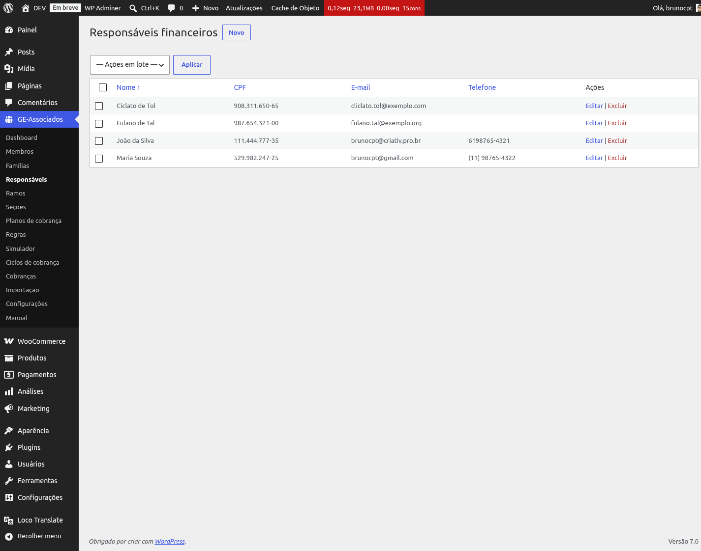
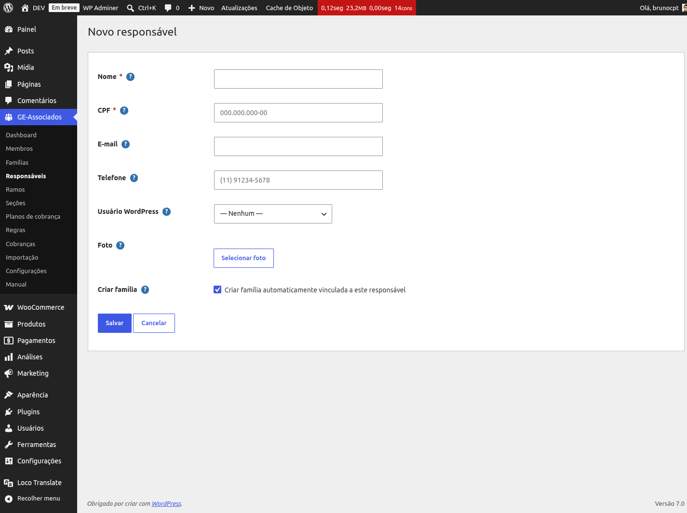

# Responsáveis financeiros

O **responsável financeiro** é a pessoa que paga as taxas de contribuição em nome de uma
família. Pode ser pai, mãe, tutor ou o próprio membro adulto.

*Listagem de responsáveis com CPF formatado e dados de contato.*

## Cadastrando um responsável

Em **GE Associados → Responsáveis**, clique em "Novo". Preencha:

- **Nome** (obrigatório) — nome completo.
- **CPF** (obrigatório) — pode ser digitado com pontos e traços ou apenas dígitos. O sistema
  valida os dígitos verificadores. CPF é único: a mesma pessoa não pode ser cadastrada duas
  vezes.
- **E-mail** e **Telefone** — para comunicações financeiras.
- **Usuário WordPress** — vínculo opcional com um usuário existente do WP, útil para futuro
  acesso ao portal financeiro.
- **Foto** — opcional, via biblioteca de mídia.

*Formulário de novo responsável. O checkbox "Criar família automaticamente" vem marcado por
padrão.*

{: .tip }
> **Atalho:** ao cadastrar um responsável *novo*, o checkbox "Criar família automaticamente"
> cria a família vinculada no mesmo passo. Como na maioria dos casos cada responsável tem uma
> família, isso economiza um clique e mantém os dois cadastros consistentes.

## Um responsável em várias famílias

Desde a versão 0.18.0, um mesmo responsável pode aparecer em várias famílias da mesma
organização — caso típico de avós ou padrinhos que custeiam mais de uma criança. O cadastro do
responsável continua único (pelo CPF).

{: .warning }
> **Excluir um responsável vinculado a família é bloqueado.** Se você tentar, o plugin recusa com
> a mensagem "Este responsável está vinculado a N família(s) (...). Remova-o das famílias antes
> de excluir." — é preciso desvincular ou apagar as famílias primeiro. A mensagem já lista em
> quais famílias e em qual papel (1º ou 2º responsável) ele aparece, para você não precisar caçar
> um a um.
