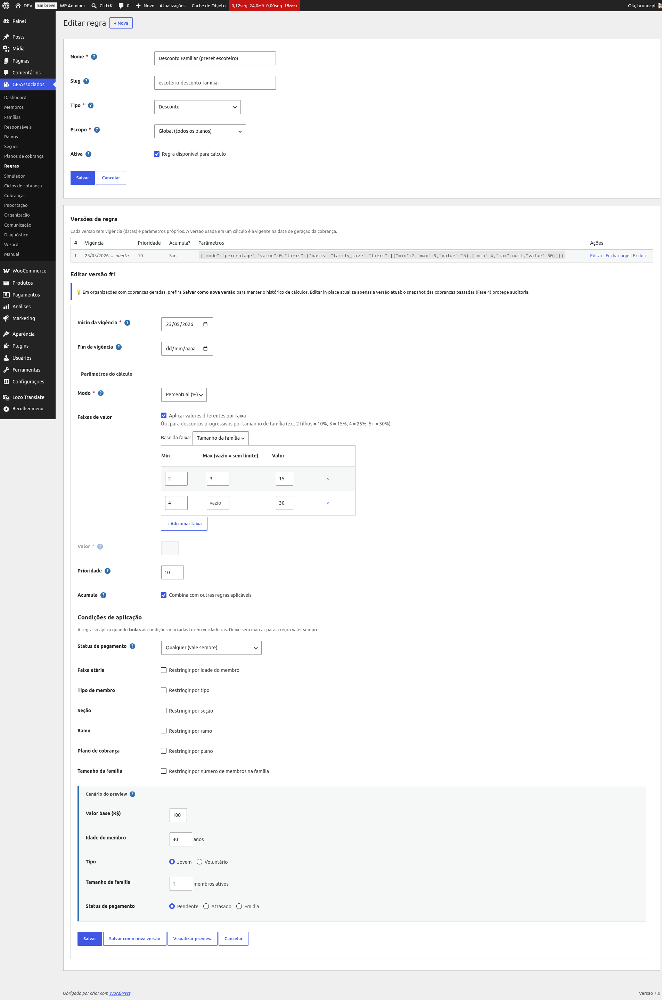
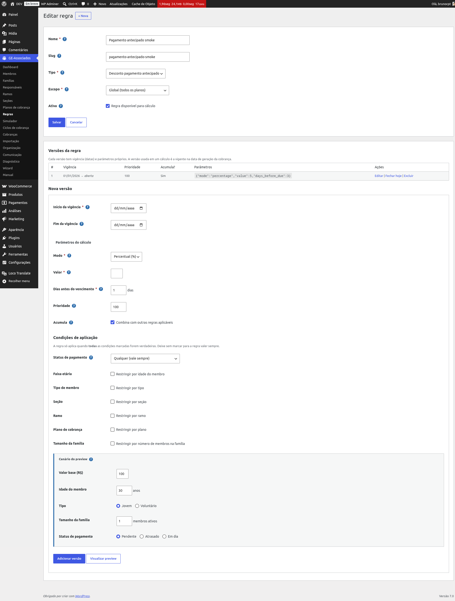

# Motor de regras

O motor de regras é o coração do cálculo de cobrança. Uma **regra** é uma instrução do tipo
"aplicar desconto X quando Y", e cada regra pode ter múltiplas **versões** com vigência
diferente (ex.: 10% em 2025, 12% em 2026). O motor combina todas as regras aplicáveis no momento
do pagamento para chegar ao valor final.

## Os 6 tipos de regra

- **Desconto** (DISCOUNT): reduz o valor base. Aplicável em qualquer condição.
- **Acréscimo** (SURCHARGE): aumenta o valor base. Útil para taxa de adesão tardia.
- **Multa por atraso** (LATE_FEE): só aplica quando o pagamento está atrasado.
- **Crédito** (CREDIT): subtrai valor fixo ou de faixa.
- **Isenção** (WAIVER): zera o total da cobrança (curto-circuita as outras regras).
- **Desconto pagamento antecipado** (EARLY_PAYMENT_DISCOUNT): aplica desconto quando o pagamento
  acontece com pelo menos X dias de antecedência. Calculado dinamicamente no momento do
  pagamento.

## Modo: percentual ou valor fixo

Para Desconto, Acréscimo, Multa e Antecipado, escolha entre **percentual** (sobre o valor base
do plano) ou **valor fixo** em reais.

## Faixas (tiers) por tamanho de família

Em Desconto, Acréscimo e Crédito, é possível definir valores diferentes por faixa de tamanho da
família. Exemplo do GEJA: "2-3 membros = 15%, 4 ou mais = 30%". Marque "Aplicar valores
diferentes por faixa" e preencha a tabela.

*Desconto por faixa de tamanho de família.*

## Condições de aplicação

Cada versão de regra pode ter condições — todas precisam ser verdadeiras para a regra aplicar:

- **Faixa etária**: mínima e/ou máxima (calculada na data de vencimento da cobrança).
- **Tipo de membro**: jovem ou voluntário.
- **Seção/Ramo/Plano**: restringe a sub-grupos específicos.
- **Status de pagamento**: "qualquer", "só em dia" (perde o benefício se atrasar), "só quando
  atrasado" (típico de multas).
- **Tamanho da família**: mínimo/máximo de membros ativos.

## Desconto pagamento antecipado

Configure com **Modo**, **Valor** e **Dias antes do vencimento** (janela mínima). Exemplo: 5% se
pago ao menos 3 dias antes. O desconto é avaliado **no momento em que o cliente abre o link de
pagamento** — não na geração da cobrança. Se o cliente abrir o link dentro da janela, vê o preço
com desconto; fora da janela, vê o preço cheio.

Veja também: [Pagamentos online → Link de pagamento](pay-link).

*Cadastro da regra EARLY: Modo, Valor e Dias antes do vencimento.*

## Versionamento e snapshot

Quando uma cobrança é gerada, o plugin grava um **snapshot das regras vigentes** naquele
momento. Esse snapshot é congelado: alterar uma regra depois *não* afeta cobranças já criadas. O
contexto do membro (idade, seção, tamanho da família), por outro lado, é avaliado dinamicamente
— se a família crescer entre a geração e o pagamento, o desconto familiar maior é aplicado.

{: .tip }
> É por causa do snapshot que você pode mudar uma regra com segurança a qualquer momento: nada
> do que já foi gerado é alterado retroativamente. A mudança só passa a valer nos próximos
> ciclos gerados a partir de então.

## Prioridade e Acumula

**Prioridade** (menor número = aplicada primeiro) controla a ordem dentro do mesmo tipo.
**Acumula** controla se a regra combina com outras do mesmo tipo: quando desmarcado, a regra é
exclusiva — se aplica, exclui as outras do mesmo tipo (a de menor prioridade ganha).

Exemplo: "Desconto Pioneiro 50% acumula=não" exclui o "Desconto Familiar 15%" no mesmo cálculo.
Mas combina com EARLY (tipos diferentes).

{: .warning }
> Duas regras do mesmo tipo com "Acumula" desmarcado e a mesma prioridade produzem um resultado
> que depende só da ordem interna de desempate — evite empatar prioridade quando "Acumula"
> estiver desligado. Se você quer garantir qual desconto vence, dê prioridades diferentes de
> propósito.
