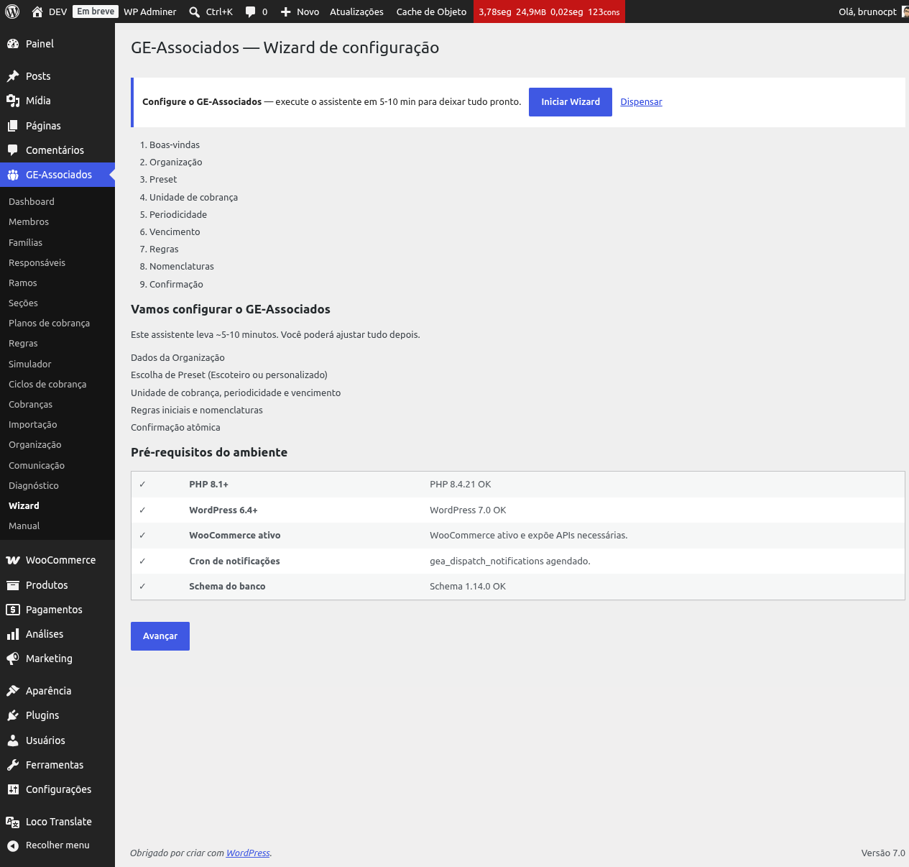
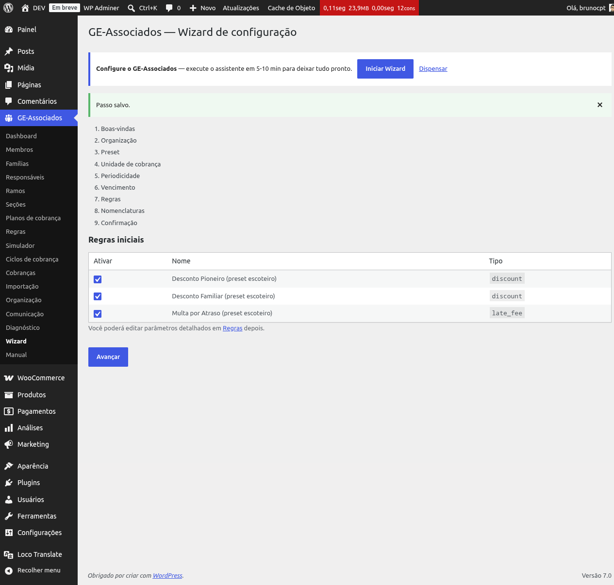
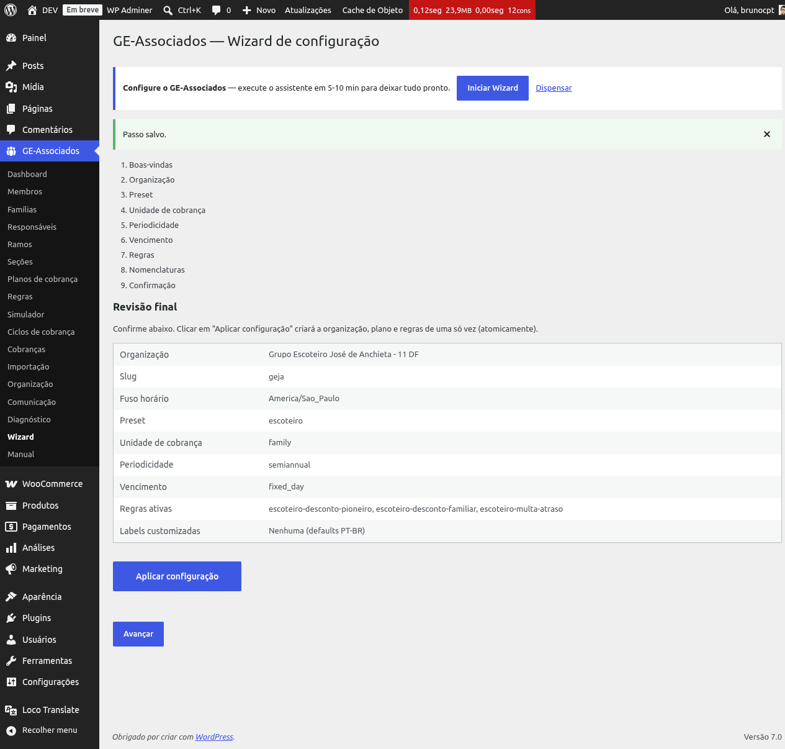

# Wizard de onboarding

O **Wizard de onboarding** é um assistente que guia a configuração inicial do plugin em 9
passos. Ele cria a organização, o primeiro plano de cobrança e as regras iniciais de uma vez só,
ao confirmar — assim você sai da instalação com algo funcional para começar a operar, em vez de
montar cada cadastro do zero, na ordem certa, sem nenhum roteiro.

## Quando o wizard aparece

O wizard é exibido automaticamente da primeira vez que você abre o plugin em uma instalação
nova (enquanto a opção `gea_wizard_completed` não estiver marcada). Depois, fica disponível pelo
item **Wizard** na barra lateral do plugin — útil para refazer a configuração se você precisar
zerar e começar de novo.

*Passo 1 — Boas-vindas: visão geral do que será configurado e checagem do ambiente (PHP,
WordPress, WooCommerce, schema do banco).*

## Os 9 passos

1. **Boas-vindas** — apresenta o que será configurado e roda um diagnóstico do ambiente inline
   (PHP, WordPress, WooCommerce, schema do banco). É a mesma checagem disponível em
   **GE Associados → Diagnóstico**, integrada ao fluxo do wizard.
2. **Unidade Escoteira** — cadastra os dados básicos: nome, slug, fuso horário e e-mail
   financeiro. Se já existe uma Unidade Escoteira cadastrada, o passo é pré-preenchido com os
   dados atuais.
3. **Preset** — escolha um preset (ex.: configuração padrão escoteira) com planos e regras
   pré-prontas, ou opte por *Começar do zero*. O preset acelera a configuração; os próximos
   passos permitem ajustes pontuais.
4. **Unidade de cobrança** — define como a cobrança é gerada: *Individual* (uma cobrança por
   associado) ou *Familiar* (uma cobrança por família). Default vem do preset selecionado.
5. **Periodicidade** — frequência da cobrança: Mensal, Trimestral, Semestral, Anual ou Pagamento
   único. Default vem do preset.
6. **Vencimento** — modo de vencimento: *Dia fixo do mês* (configura o dia e mês inicial),
   *Relativo ao evento* (N dias após a geração) ou *Manual*.
7. **Regras** — lista as regras propostas pelo preset (descontos, multas, isenções etc.) com
   checkbox para ativar/desativar cada uma. Os parâmetros detalhados podem ser editados depois
   em **GE Associados → Regras**.
8. **Nomenclaturas** — personaliza rótulos do plugin (Membro, Família, Seção, Ramo, Responsável
   financeiro, Plano de cobrança). Em branco, usa o padrão PT-BR.
9. **Confirmação** — revisão final com resumo de tudo que será criado. O botão **Aplicar
   configuração** dispara a criação efetiva.

*Passo 7 — Regras: tabela com as regras propostas pelo preset (descontos, multas) com checkbox
para ativar cada uma.*

## O que acontece ao confirmar

Ao clicar em **Aplicar configuração** no último passo, o plugin executa uma única operação
sequencial:

1. Cria ou atualiza a **Unidade Escoteira**.
2. Persiste as **nomenclaturas** customizadas.
3. Aplica o **preset**: cria o plano de cobrança e as regras marcadas como ativas, com os
   *overrides* coletados nos passos 4 a 7.
4. Marca `gea_wizard_completed=true` com timestamp.

Se qualquer passo falhar, o erro é tratado centralmente: o wizard não é marcado como concluído e
a mensagem aparece na tela — você pode corrigir o problema (ex.: dados inválidos, ambiente sem
permissão) e tentar novamente sem perder o que foi preenchido nos passos anteriores.

*Passo 9 — Confirmação: revisão completa antes do botão "Aplicar configuração".*

## Quando refazer o wizard

O wizard pode ser refeito sempre que necessário pelo menu lateral **Wizard**. Os dados
existentes da organização hidratam automaticamente o passo 2 e os campos de cada passo, então
você só precisa ajustar o que mudou. Se o preset criar novamente um plano ou regra que já
existe, a tela final do wizard mostra a contagem do que foi *criado* e do que foi *ignorado* (já
existia).

{: .warning }
> Para começar realmente do zero — apagando cadastros existentes — é preciso limpar os dados
> pela tela de Diagnóstico. É uma operação destrutiva: peça orientação do suporte antes de usá-la,
> porque ela não tem desfazer.

{: .note }
> Cada passo do wizard valida apenas o que foi preenchido nele. A validação final dos dados
> (CPF, e-mail, fuso horário etc.) acontece na confirmação — se algo estiver inválido, você volta
> para o passo correspondente e corrige.
