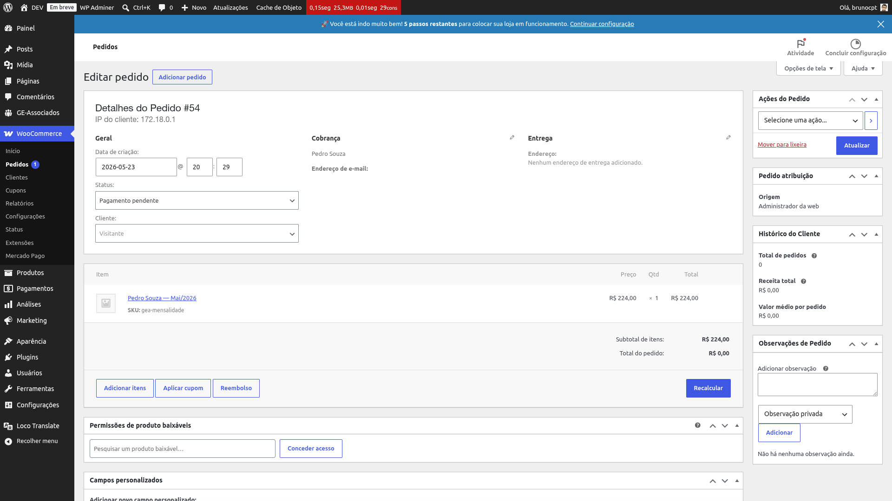

# Integração WooCommerce

O plugin se integra ao **WooCommerce** para transformar cada cobrança em um pedido real, com
link de pagamento próprio, status de pagamento sincronizado e gateway agnóstico. O administrador
não cria produtos públicos nem precisa ajustar checkout — toda a montagem do pedido é feita pelo
plugin no momento da geração das cobranças.

## Pré-requisitos

- **WooCommerce 8.0+** ativo na mesma instalação do WordPress.
- **HPOS (High-Performance Order Storage)** recomendado. O plugin é compatível com o storage
  clássico (post type `shop_order`) e com HPOS — em instalações novas, deixe o HPOS ativo por
  padrão (configuração WooCommerce).
- Pelo menos um **gateway de pagamento ativo**. Qualquer gateway compatível com WooCommerce
  funciona: Mercado Pago, Stripe, PagSeguro, PayPal, transferência bancária, depósito etc. O
  plugin não amarra a um gateway específico.

{: .note }
> Quando o WooCommerce está ausente ou desativado, o plugin mostra um aviso no topo do admin e
> segue funcionando em modo manual — cobranças continuam sendo geradas, mas sem pedido vinculado
> nem link de pagamento. Reative o WooCommerce e use o botão *Tentar criar pedido* na aba Resumo
> da cobrança (ou aguarde o cron diário).

## Como o plugin se integra

Sempre que um ciclo é confirmado, o plugin monta o pedido WooCommerce automaticamente para cada
cobrança gerada:

- **Cliente convidado (guest):** o pedido é criado sem vincular a um usuário WordPress. O plugin
  *não cria usuários WordPress novos* para os responsáveis financeiros — eles permanecem só no
  cadastro do plugin. Isso evita poluir a tabela de usuários e mantém o controle de acesso
  intacto.
- **Billing populado automaticamente:** em planos *Individual*, o nome de cobrança vem do
  próprio **Membro**. Em planos *Familiar*, vem do **1º responsável financeiro (R1)** da
  família, com nome, e-mail e telefone. Se a família tem 2º responsável (R2) e o financeiro
  configurado é *Ambos* ou *Apenas o 2º*, o e-mail do R2 é gravado numa meta auxiliar (ver
  abaixo) para que a comunicação possa atingir os dois sem alterar o billing principal.
- **Item fictício técnico:** cada linha do pedido aponta para um produto interno técnico. Até a
  v1.1.3 esse produto era um só para toda a organização (SKU `gea-mensalidade`); a partir da
  v1.1.4, cada plano com [categoria de produto](billing-plans#categoria-de-produto-woocommerce)
  definida ganha o próprio produto técnico. Em qualquer caso, o produto é *hidden* (não aparece
  em catálogo), *virtual* (não exige envio) e tem preço base `0,00` — o valor real é gravado
  direto na linha, com label "Nome do Membro — Mês/Ano". Em cobranças familiares, há uma linha
  por membro coberto.
- **Gateway agnóstico:** o checkout do WooCommerce decide qual gateway aparece para o cliente com
  base nas configurações da loja. O plugin não interfere — confirmação de pagamento e fluxo de
  reembolso funcionam exatamente como em qualquer pedido WC.

## Categoria de produto por plano

*Desde a v1.1.4.* Cada [plano de cobrança](billing-plans) pode ser vinculado a uma categoria de
produto do WooCommerce. Quando um plano tem categoria, o plugin passa a usar um produto técnico
próprio daquele plano (em vez do produto genérico compartilhado) e o classifica na categoria
escolhida — assim os relatórios da loja (receita por categoria etc.) separam as cobranças por
plano, sem tocar no financeiro do WooCommerce diretamente.

{: .warning }
> Trocar a categoria de um plano reclassifica **todos** os pedidos que já apontam para o produto
> técnico dele, inclusive os pagos há meses — porque a categoria é uma propriedade do produto, e
> o produto é reaproveitado, não recriado. Ver o detalhe completo em
> [Planos de cobrança → Categoria de produto WooCommerce](billing-plans#categoria-de-produto-woocommerce).

## Metas gravadas no pedido

Para reconectar pedido WC → cobrança GE em qualquer momento (e habilitar recálculo dinâmico no
link de pagamento, confirmação automática, refund etc.), o plugin grava metadados internos no
pedido: o id da cobrança correspondente, o id do ciclo de cobrança de origem, a data de
vencimento original (independente da data do pedido WC) e, quando aplicável, o e-mail do 2º
responsável. Em pedidos familiares, cada linha também recebe o id do membro que ela representa —
usado pelo recálculo dinâmico para atualizar valores individuais sem confundir as linhas.

{: .note }
> O WooCommerce *oculta* por padrão metadados técnicos (prefixados com `_`) no painel do pedido.
> Para inspecionar essas informações de um pedido específico, use a API REST do WooCommerce ou
> peça apoio técnico — não é algo visível direto na tela do pedido.

*Pedido WC criado pelo plugin. As metas técnicas ficam armazenadas no banco mas não aparecem
visualmente no painel — para inspecioná-las use REST/SQL.*

{: .note }
> Pedidos WooCommerce que não vêm do GE Associados são totalmente ignorados pelos hooks do
> plugin. Pedidos de outras origens (vendas avulsas, outros plugins) continuam funcionando
> normalmente, sem qualquer interferência do GE Associados.
